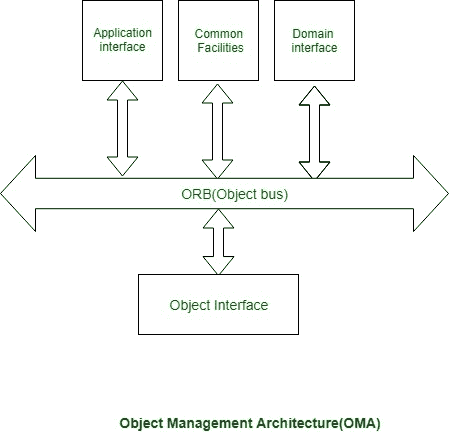

# 客户端-服务器软件开发|通用对象请求代理架构(CORBA)简介

> 原文:[https://www . geesforgeks . org/client-server-software-development-introduction-to-common-object-request-broker-architecture-CORBA/](https://www.geeksforgeeks.org/client-server-software-development-introduction-to-common-object-request-broker-architecture-corba/)

**通用对象请求代理架构(CORBA)** 可以是中间件常规设计的规范。它是一个客户端-服务器软件开发模型。

使用 CORBA 实现，购物者将透明地调用服务器对象上的一种方式，这种方式可以在类似的机器上或通过网络传播。中间件做出决定，相关的责任是找到一个将实现请求的对象，将参数传递给它，调用它的方法，并返回调用的结果。购物者不需要记住物品在哪里，它的编程语言，它的软件包或者其他不属于相关对象界面的方面。

**CORBA 参考模型:**
被称为对象管理设计(OMA)的 CORBA 参考模型如下图所示。OMA 本身就是一个规范(实际上是一组相互关联的规范)，它定义了各种各样的服务来构建分布式客户机-服务器应用程序。人们可能期望在像 CORBA 这样的非常中间件的产品中搜索到的几个服务(例如，命名、交易和异步事件管理服务)实际上被固定为 OMA 中的服务

不同的部分交流受害 ORB。ORB 也被称为项目总线。应用程序接口的一个相关例子是分布式文档工具。在一个非常领域的接口中，它将有领域相关的服务，例如，产生领域。

对象接口有一些领域自由服务:

1.  **命名服务:**
    命名服务又称为白页服务。受害命名服务服务器名称将被搜索，并指出其位置或地址。

2.  **交易服务:**
    商业化服务又被称为黄页服务。受害商业化服务将搜索选定的服务。这通常对应于在非常黄的页面目录中查看像汽车商店这样的服务。

**注意:**
会有不同的服务，可能是由对象接口提供的，比如安全服务、生命周期服务等等。