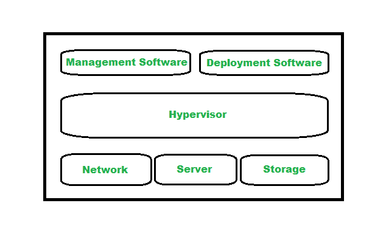

# 云计算基础设施

> 原文:[https://www . geeksforgeeks . org/云计算-基础设施/](https://www.geeksforgeeks.org/cloud-computing-infrastructure/)

**先决条件–**[云计算](https://www.geeksforgeeks.org/cloud-computing/)

云计算是当前场景的需求技术之一，已被证明是各种规模企业的革命性技术趋势。它管理着广泛而复杂的基础设施设置，为客户提供云服务和资源。云基础设施属于云架构的后端部分，代表服务器、存储、网络、管理软件、部署软件和虚拟化软件等硬件和软件组件。在后端，云基础设施支持完整的云计算系统。

**为什么是云计算基础设施:**

云计算是指随时随地向客户提供按需服务，而不管云基础设施代表的是激活整个云计算系统的人。云基础设施更有能力向客户提供与物理基础设施相同的服务。它可用于[私有云、公共云和混合云系统](https://www.geeksforgeeks.org/types-of-cloud/)，成本低，灵活性和可扩展性更强。

**云基础设施组件:**

云基础设施的不同组件支持云计算模型的计算需求。云基础设施有许多关键组件，但不仅限于服务器、软件、网络和存储设备。云基础架构通常分为三个部分，即

1.  **计算**
2.  **联网**
3.  **储存**

最重要的一点是，云基础设施应该有一些基本的基础设施约束，如透明度、可扩展性、安全性和智能监控等。

下图**表示云基础设施的组件**

云基础架构的组件

**1。虚拟机管理程序:**

虚拟机管理程序是固件或低级程序，是实现虚拟化的关键。它用于在多个客户之间划分和分配云资源。因为它监视和管理云服务/资源，所以虚拟机管理程序被称为 VMM(虚拟机监视器)或(虚拟机管理器)。

**2。管理软件:**

管理软件有助于维护和配置基础架构。云管理软件监控和优化资源、数据、应用和服务。

**3。部署软件:**

部署软件有助于在云上部署和集成应用程序。因此，它通常有助于构建虚拟计算环境。

**4。网络:**

它是云基础设施的关键组成部分之一，负责通过互联网连接云服务。为了在外部和内部传输数据和资源，必须使用网络。

**5。服务器:**

代表云基础设施计算部分的服务器负责管理和为各种服务和合作伙伴提供云服务，维护安全性等。

**6。存储:**

存储代表提供给不同组织用于存储和管理数据的存储设施。它提供了一种工具，如果其中一个资源出现故障，可以提取另一个资源，因为它保留了许多存储副本。

与此同时，虚拟化也被认为是云基础设施的重要组成部分之一。因为它将可用的数据存储和计算能力从实际硬件中抽象出来，用户通过图形用户界面与他们的云基础设施进行交互。