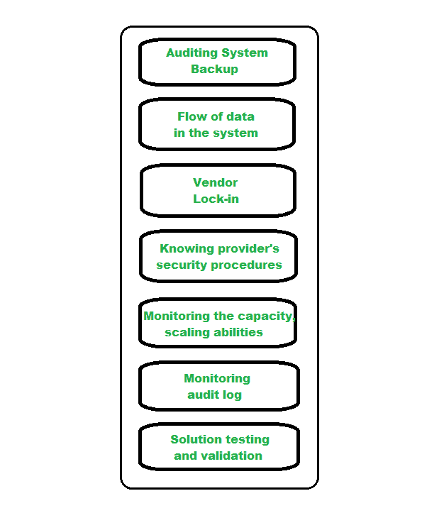

# 云计算中的云管理

> 原文:[https://www . geesforgeks . org/cloud-management-in-cloud-computing/](https://www.geeksforgeeks.org/cloud-management-in-cloud-computing/)

前提条件:[云计算](https://www.geeksforgeeks.org/cloud-computing/)

**云计算管理**是维护和控制云服务和资源，无论是公共的、私有的还是混合的。它的一些方面包括负载平衡、性能、存储、备份、容量、部署等。为此，云管理人员需要完全访问云中资源的所有功能。不同的软件产品和技术结合在一起，提供了一个有凝聚力的云管理策略和流程。

正如我们所知[私有云](https://www.geeksforgeeks.org/features-components-of-private-cloud/)基础设施只为单个组织运营，因此可以由组织或第三方管理。公共云服务通过开放且可供公众使用的网络交付。在这种模式下，信息技术基础设施归私营公司所有，公众可以根据需要购买或租赁数据存储或计算能力。混合云环境是来自不同提供商的公共和私有云服务的组合。大多数组织出于隐私考虑将数据存储在私有云服务器上，同时以较低的价格利用公共云应用程序来处理不太敏感的信息。公共云和私有云的结合被称为混合云服务器。

**云管理的需求:**
如今，大型组织更喜欢将云作为他们的主要数据存储。一个小的停机时间或一个错误可能会给组织带来巨大的损失和不便。为了设计、处理和维护云计算服务，特定的成员负责确保事情按预期进行，所有出现的问题都得到解决。

**云管理平台:**
云管理平台是一种软件解决方案，它具有一套强大而广泛的 API，允许它从 it 基础架构的每个角落提取数据。化学机械抛光允许信息技术组织建立结构化的安全和信息技术治理方法，可在组织的整个云环境中实施。

**云管理任务:**
下图代表不同的云管理任务:

云管理任务

*   **审核系统备份–**
    需要不定期审核备份，确保不同用户随机选择的文件得到恢复。这可能由组织或云提供商完成。
*   **系统中的数据流–**
    管理人员负责设计数据流图，显示数据应该如何在整个组织中流动。
*   **供应商锁定–**
    管理人员应该知道如何将其数据从一台服务器转移到另一台服务器，以防组织决定更换提供商。
*   **了解提供商的安全程序–**
    管理人员应了解提供商的安全计划，尤其是多租户使用、电子商务处理、员工筛选和加密策略。
*   **监控容量、规划和扩展能力–**
    经理应该知道他们当前的云提供商是否能够满足他们组织未来的需求以及他们的扩展能力。
*   **监控审计日志–**
    为了识别系统中的错误，管理人员定期对日志进行审计。
*   **解决方案测试和验证–**
    有必要测试云服务并验证结果以及无错误的解决方案。