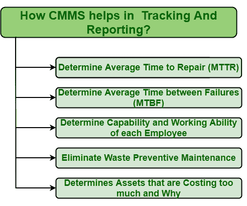

# CMMS 在追踪报道

> 原文:[https://www . geesforgeks . org/CMMs-in-tracking-and-reporting/](https://www.geeksforgeeks.org/cmms-in-tracking-and-reporting/)

跟踪和报告数据是一种数据挖掘，即通常用于从任何原始数据的更大集合中跟踪数据的过程，该过程只是将这些原始数据转换成有用的信息。CMMA 是更有效地进行数据挖掘的最佳软件工具之一。

[CMMS](https://www.geeksforgeeks.org/computerized-maintenance-management-systemcmms/) 基本上是帮助一个人做出一个提高效率，节约资产成本的决策。CMMS 帮助人们收集、跟踪、识别和分析过去资产表现的资产数据。它允许用户从维护操作的各个领域收集信息，并使其对报告模板有用。跟踪工作状态、报告和分析这些报告的数据通常有助于管理工作、生成报告，也有助于控制成本。

**CMMS 如何帮助跟踪和报告的步骤:**
以下是 CMMS 帮助跟踪和报告数据的一些方法。

1.  **确定平均修复时间(MTTR) :**
    MTTR(平均修复时间)基本上呈现了解决问题和修复故障资产所需的平均时间。将故障资产恢复到正常工作状态所需的平均时间。确定 MTTR 只是帮助确定如果发生故障，资产将停止使用多长时间。这也让人明白过度依赖一种资产的后果。它还决定了团队成员工作和解决问题的效率和速度。因此，MTTR 非常重要，CMMS 是决定 MTTR 的最佳工具。CMMS 通常帮助人们跟踪与团队成员花费在维护上的时间、故障总数以及修复时间相关的数据。

*   **确定平均故障间隔时间(MTBF) :**
    MTBF(平均故障间隔时间)基本上表示资产故障间隔的平均时间。它只是确定资产在两次故障之间的平均工作时间。借助于 MTBF，可以很容易地确定资产的工作状况、资产的可靠性、资产的性能、资产的关键程度等。因此，平均无故障时间非常重要，CMMS 是确定平均无故障时间的最佳工具。CMMS 只是帮助人们确定一项资产在破产前可以运行多长时间。还可以减少资产的停机时间。*   **决定每个员工的能力和工作能力:**
    工人和员工如何工作是每个组织的主要问题。员工的工作能力通常意味着在给定时间内完成给定任务的能力。组织雇佣的每一名员工都应该能够自信地、更有效地与团队成员一起工作。确定每个员工的工作技能非常重要，因为这些技能只告诉我们它们是否适合做特定的事情。CMMS 是一个软件工具，通过简单地跟踪员工的工作订单来帮助人们确定每个员工的工作能力，以便人们可以以不同的方式提高员工的生产率和准确性，并在需要时提供一些培训。*   **消除浪费预防性维护:**
    是的，预防性维护很重要，但定期维护简直就是浪费资源和金钱。只有在需要进行预防性维护时，才进行预防性维护。CMMS 是确定何时应该执行预防性维护的最佳方法。CMMS 只是记录资产的工作状况，并在可能发生故障时发出警报。通过这种方式，人们可以轻松地采取措施并执行预防性维护，以防止资产出现故障。*   **确定成本过高的资产和原因:**
    无论发生了什么，总会有一个问题，为什么会发生。资产是需要维护以保持不间断运行的东西。但是维护成本是任何组织的衡量标准。管理维护成本是一件困难的事情。人们需要确定哪些资产成本过高，为什么。CMMS 是一个有助于回答这个问题的工具，因为 CMMS 记录了资产的工作性能、平均无故障时间和 MTTR 资产。在这些信息的帮助下，人们可以很容易地跟踪太贵的资产以及为什么贵，从而可以采取一些措施来降低维护成本。