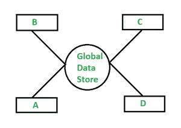
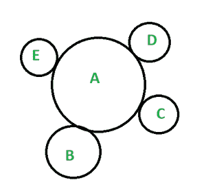
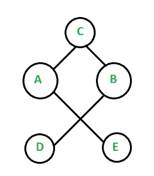

# 软件工程中常见的耦合

> 原文:[https://www . geesforgeks . org/common-coupling-in-software-engineering/](https://www.geeksforgeeks.org/common-coupling-in-software-engineering/)

**什么是耦合？**

耦合只是衡量多个模块之间的相互依赖，或者我们可以说软件开发过程中两个或多个模块的依赖。它解决了编程部分如何相互依赖的问题。对于非常有计划的编程，应该有低耦合和高耦合，以保持其可靠性和有效性。

**什么是公共耦合？**

公共耦合，也称为全局耦合，可以定义为不同模块通过使用全局数据共享某些信息的一种耦合类型。在编程语言中可以很容易地找到全局数据。在公共耦合中使用全局数据会导致未检查的错误分布，并在进行更改时出现意外问题。公共耦合是两个或多个模块共享一些全局数据结构的耦合类型之一。对全局信息字段执行的任何更改都会返回并提示通过它获取数据的每个模块。当对全局信息进行更改时，它会产生一些传输错误和未识别的问题。这在重用模块的同时产生了问题，并限制了处理类似信息源上的各种模块的信息访问的能力。

公共耦合的模块通过使用全局数据结构连接在一起，并且模块具有读/写访问权限，并且可以通过全局数据块交换数据。我们可以通过减少公共全局数据的使用或通过分离来控制这种耦合。实现这一点的另一种方法是为不同的模块设计模式，并使它们适合获得可接受的设计。

**常见耦合示例:**

下图显示了一个框架内的全局耦合，其中四个不同的模块，A、B、C 和 D 共享常规的全局信息。事实上，考虑到从全局信息存储接收信息的每个模块都应该进行调整，即使全局信息存储中的一点点更改也会导致问题。

图:全球数据存储

普通耦合属于重要级别紧密耦合的范畴，然而，这并不吸引人，现在，它在产品配置措施中再次变得重要。紧密耦合意味着程序中的各种模块相互之间有很强的依赖性。通常，公共耦合提供紧密耦合，这降低了模块的适应性和再便利性。

图:紧密耦合

***图:紧密耦合*** 显示不同模块之间的耦合非常紧密。而下面给出的 ***图:松耦合*** 说明了这些不同的模块，即 A、B、C、D 是如何非常松耦合的。

图:松耦合

**我们再看一个例子:**

这种耦合同样允许有空间来表示与交互相关的优点和障碍。需要避免这种类型的依赖，因为它需要更多的维护和对模块更少的权限。这种耦合的另一个例子是登录页面，其中登录模块和后端模块相关联，因为登录批准发生在登录页面级别和后端信息库级别。