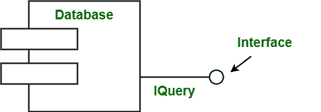
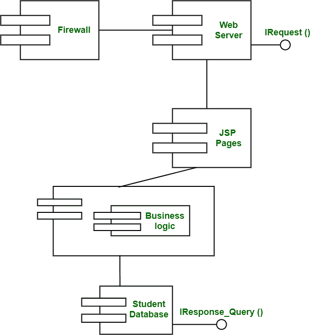

# 基于组件的图表

> 原文:[https://www.geeksforgeeks.org/component-based-diagram/](https://www.geeksforgeeks.org/component-based-diagram/)

**组件图**用于在[统一建模语言](https://www.geeksforgeeks.org/unified-modeling-language-uml-introduction/)中显示系统的代码模块。它们通常用于建模子系统。它表示每个组件在系统程序的执行和运行过程中是如何工作的。它们也用于显示和表示所有组件的结构和组织。这些代码模块包括应用程序、ActiveX 控件、Java Beans、后端数据库或一些 ASP 程序。组件图表示视图模型的实现。组件图用于表示软件架构之间的接口和依赖关系。“组件”这个词只是指一个类的模块，通常代表一个独立的子系统。

这些组件具有与系统其余部分接口的能力。组件图用于解释系统各种组件的工作和行为，是 UML 的静态图。它们也用于子系统建模。组件图的主要目的是简单地显示系统各组件之间的关系。

组件和界面如下所示:

**示例–**
以下是“在线课程注册”系统的组件图。此图显示了服务器端组件的概念视图。

**优势:**

*   组件图非常简单、标准化，并且非常容易理解。
*   它在表示系统实现时也很有用。
*   当您想要设计包含输入输出插座的设备时，这些非常有用。
*   可回收组件的使用也有助于降低整体开发成本。
*   修改和更新实现非常容易，不会引起任何其他副作用。

**缺点:**

*   它们不能用于设计网页、应用程序等软件。
*   它还要求为每个组件提供设备和致动器。