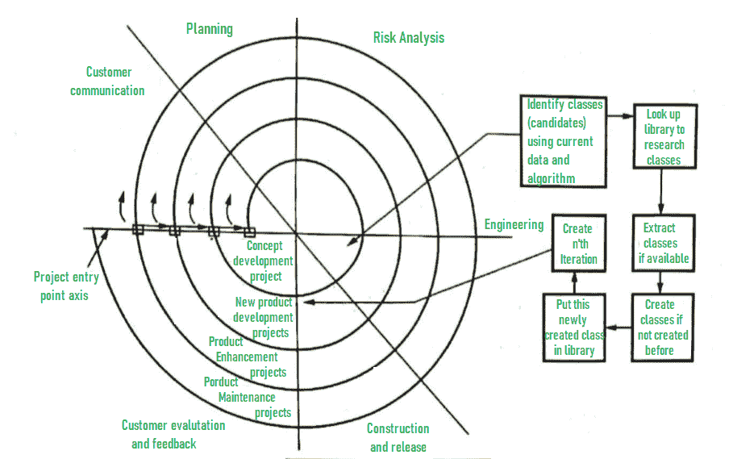

# 基于组件的模型

> 原文:[https://www.geeksforgeeks.org/component-based-model-cbm/](https://www.geeksforgeeks.org/component-based-model-cbm/)

基于组件的装配模型使用面向对象技术。在面向对象技术中，重点是类的创建。类是封装数据和算法的实体。

在基于组件的体系结构中，类(即构建应用程序所需的组件)可以用作可重用组件。这个模型利用了螺旋模型的各种特性。这种模式本质上是进化的。因此，软件开发可以使用迭代方法来完成。在 CBD 模型中，可以使用多个类。这些类基本上是预打包的组件。

该模型的工作方式如下:

*   **步骤-1:**
    首先借助应用数据和算法识别所有需要的候选组件，即类。
*   **步骤-2:**
    如果这些候选组件在以前的软件项目中使用，那么它们必须存在于库中。
*   **步骤-3:**
    这种预先存在的成分可以从库中激发出来，用于进一步开发。
*   **步骤-4:**
    但是如果所需的组件不在库中，那么根据需求构建或创建组件。
*   **第 5 步:**
    将这个新创建的组件放入库中。这使得系统迭代一次。
*   **步骤-6:**
    重复步骤 1 到 5 创建 n 个迭代，其中 n 表示开发完整应用程序所需的迭代次数。

