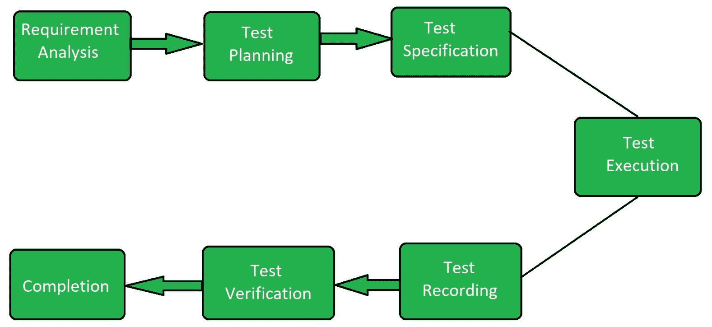

# 组件软件测试

> 原文:[https://www.geeksforgeeks.org/component-software-testing/](https://www.geeksforgeeks.org/component-software-testing/)

**组件测试**是一种类型的[软件测试](https://www.geeksforgeeks.org/software-testing-basics/)，其中测试每个单独组件的可用性。除了可用性测试，还会对每个组件进行行为评估。为了执行这种类型的测试，每个组件需要处于独立状态，并且也应该处于可控状态。软件的每个组件都应该是用户可理解的。

假设软件应用程序由五个组件组成。在对每个组件进行集成测试之前，作为开发周期的一部分，每个组件的测试都是由测试人员独立完成的。它有助于节省时间，因为它可以在周期的早期发现错误。测试结构工具或调试工具用于这种类型的测试，因为这是由程序员在集成开发环境的支持下对他们编写的代码执行的。在组件测试期间检测到的缺陷在发现时会尽快修复，而无需维护记录。

组件测试在发现问题方面有着重要的作用。在进行集成测试之前，要进行组件测试，以确保应用程序的每个组件都按照要求正常工作。

**组件测试的目标:**
组件测试的目标是:

*   验证系统的输入和输出行为。
*   检查每个组件的可用性。
*   测试用户对软件的理解程度。
*   测试系统每个组件的状态。

**组件测试流程:**

*   **需求分析:**
    观察每个组件相关的用户需求。
*   **测试规划:**
    测试根据用户需求分析进行规划。
*   **测试规范:**
    在本节中规定了必须运行哪个测试用例以及应该跳过哪个测试用例。
*   **测试执行:**
    一旦根据用户需求指定了测试用例，就执行测试用例。
*   **测试记录:**
    测试记录是对检测到的缺陷的记录。
*   **试验验证:**
    试验验证是确定产品是否符合规格的过程。
*   **完成:**
    这是分析结果的测试过程的最后阶段。