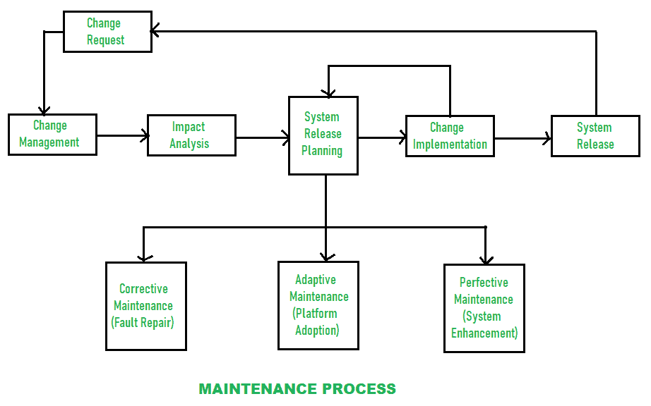

# 软件维护流程的组成部分

> 原文:[https://www . geesforgeks . org/components-of-software-maintenance-process/](https://www.geeksforgeeks.org/components-of-software-maintenance-process/)

维护是通过修改现有系统的结构或向系统添加新组件来实现更改的过程。系统需求变化很快，为了满足这一需求，系统中加入并维护了一些变更。维护的系统在他们的工作环境中仍然有用。维护适用于使用任何软件生命周期模型开发的软件。需要进行维护以纠正故障、实施增强、改进设计、采用环境等。目前存在不同类型的软件维护，如纠正性维护、适应性维护、完善性维护和预防性维护。

软件维护流程有不同的组成部分，如下所示:

**1。变更请求–**
在最初的维护过程中，会提出变更请求。

**2。变更管理–**
在这里，所有变更请求的状态都被识别和描述。

**3。影响分析–**
在此开展以下活动:

*   确定受变更请求影响的所有系统和系统产品。
*   估计实施变革所需的资源。
*   分析改变的好处。

**4。系统发布计划–**
在此阶段，计划软件发布的时间表和内容。可以对所有类型的软件维护进行更改。

**5。变更实现–**
变更的实现可以通过首先设计变更，然后为这些变更编码，最后测试变更。优选地，回归测试必须在测试变化时进行。

**6。系统发布–**
软件发布过程中，需要说明以下几点:

*   证明文件
*   软件
*   培养
*   硬件变化
*   数据变换