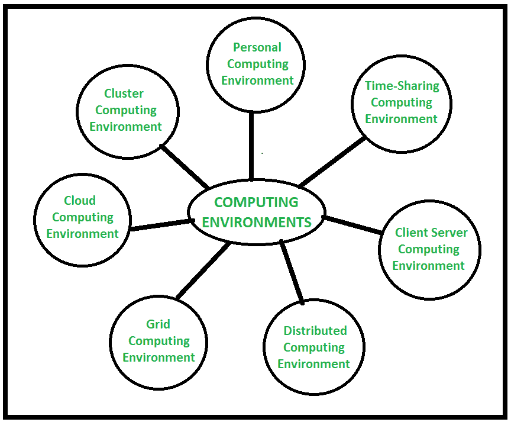

# 计算环境

> 原文:[https://www.geeksforgeeks.org/computing-environments/](https://www.geeksforgeeks.org/computing-environments/)

在科技世界里，每项任务都是在计算机的帮助下完成的，这些计算机已经成为人类生活的一部分。计算不过是利用这种计算机技术完成一项任务的过程，它可能涉及计算机硬件和/或软件。但是计算使用某种形式的计算机系统来管理、处理和交流信息。在对计算有了一些了解之后，现在让我们了解一下**计算环境**。

**计算环境:**
当一个问题被计算机解决时，在此期间，计算机使用许多设备，以不同的方式排列，这些设备一起工作来解决问题。这构成了一个计算环境，其中各种数量的计算机设备以不同的方式排列，以不同的方式解决不同类型的问题。在不同的计算环境中，计算机设备以不同的方式排列，它们在它们之间交换信息以处理和解决问题。一个计算环境由许多计算机、其他计算设备、软件和网络组成，支持处理和共享信息以及解决任务。

基于不同计算机设备和通信过程的组织，存在多种类型的**计算环境**。现在让我们了解不同类型的计算环境。

**计算环境的类型:**
是各种类型的计算环境。它们是:

计算环境类型

1.  **个人计算环境:**
    在个人计算环境中有一台单机。完整的程序驻留在计算机上并在那里执行。构成个人计算环境的不同单机是笔记本电脑、手机、打印机、计算机系统、扫描仪等。我们在家里和办公室使用的。
2.  **分时计算环境:**
    在分时计算环境中，多个用户同时共享系统。不同的用户(不同的进程)被分配不同的时间片，处理器根据时间片在用户之间快速切换。例如，学生一边听音乐一边在 IDE 中编写代码。Windows 95 及更高版本、Unix、IOS、Linux 操作系统就是这种分时计算环境的例子。
3.  **客户端服务器计算环境:**
    在客户端服务器计算环境中，涉及两台机器，即客户端机器和服务器机器，有时同一台机器同时充当客户端和服务器。在这个计算环境中，客户机请求资源/服务，而服务器提供相应的资源/服务。一台服务器可以同时为多个客户端提供服务，这里主要通过计算机网络进行通信。
4.  **分布式计算环境:**
    在分布式计算环境中，多个节点使用网络连接在一起，但在物理上它们是分开的。单个任务由分布式单元的不同节点的不同功能单元执行。在这里，一个应用程序的不同程序在不同的节点上同时运行，并且通过网络在该系统的不同节点之间进行通信以解决任务。
5.  **网格计算环境:**
    在网格计算环境中，来自不同位置的多台计算机处理一个问题。在该系统中，运行在集群中的一组计算机节点通过应用多个计算机/节点的资源来共同执行给定的任务。它是由几个分散的资源为单个任务提供运行环境的计算环境网络。
6.  **云计算环境:**
    在云计算环境中，处理和存储等计算机系统资源按需可用。在这里，计算不是在单独的技术或计算机中完成的，而是在计算机云中计算的，所有所需的资源都由云供应商提供。该环境主要由三项服务组成，即[软件即服务(SaaS)、基础设施即服务(IaaS)和平台即服务(PaaS)](https://www.geeksforgeeks.org/difference-between-iaas-paas-and-saas/?ref=rp) 。
7.  **集群计算环境:**
    在集群计算环境中，集群执行任务，其中集群是一组松散或紧密连接的计算机，它们一起工作。它被视为单个系统，并行执行任务，这也是它类似于并行计算环境的原因。集群感知应用特别用于集群计算环境。