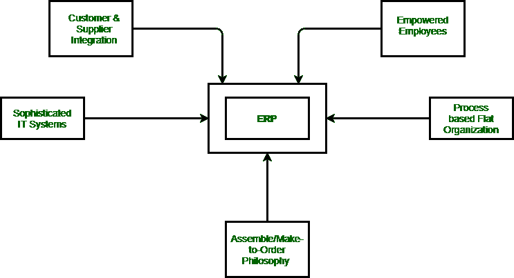

# ERP 概念模型

> 原文:[https://www.geeksforgeeks.org/conceptual-model-of-erp/](https://www.geeksforgeeks.org/conceptual-model-of-erp/)

下图为 [ERP](https://www.geeksforgeeks.org/introduction-to-erp/) 理论所依据的概念模型。企业资源规划定义了管理业务策略的五项措施:

1.  基于流程的扁平化组织
2.  按订单装配或按订单生产的理念
3.  授权员工
4.  客户和供应商整合
5.  复杂的信息技术系统

图:概念 ERP 模型:ERP 的支柱

这些业务政策导致企业资源规划系统的关键要素。企业资源规划的成功取决于其在组织中的采用程度。

牢记上述概念，企业资源规划可以通过以下方式进行定义:

1.  它是一种基于企业所有业务流程顺利集成的规划方法论或哲学。
2.  它是一套涵盖主要业务领域(如经济、计划、销售、材料、制造、分销)的软件，这些领域相互紧密结合，以至于在一个地方记录的任何业务活动都会立即反映在所有其他地方。
3.  这是信息技术和商业一致性的最佳体现。一个具有使能技术和有效管理工具的全企业系统，用于整合所有级别和提高报告能力。

上述定义解释了作为基于系统的业务解决方案的企业资源规划的基本设计特征。企业资源规划整合了整个组织的各个部门和职能。它试图将一切都理解为一个单一的系统，可以服务于每个部门和功能需求。在这样做的同时，它侧重于业务计划领域，并以综合规划方法解决这些问题。

要理解企业资源规划是如何基于系统的业务解决方案，我们必须首先批判性地检查两个关键词“系统”和“解决方案”。

**系统:**

在目前的背景下，我们可以说，企业资源规划是一个系统的特定集合或安排的元素，组织起来，以实现一个预先定义的目标，通过处理信息。这个目标始终可以是支持现有的业务功能，提高数据的透明度，提高业务效率，改进决策，并提高客户满意度。这种系统的关键资源要素是硬件、软件、用户、数据库等。

**解决方案:**

业务解决方案可以解释为一个框架，包括战略、组织结构、关键绩效指标、衡量标准和信息技术，必须与业务流程保持一致。按照惯例，有三种业务流程——获取和支付投入资源，将投入转化为提供的成品和服务。

因此，企业资源规划作为系统和业务解决方案的结合，为用户提供了一个高效的规划工具。