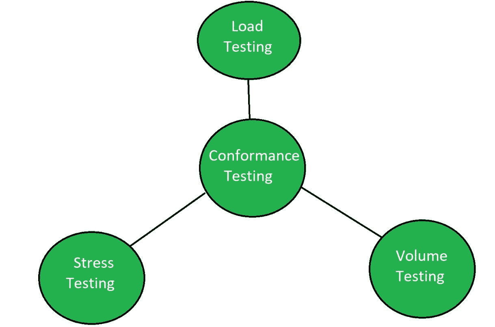

# 一致性软件测试

> 原文:[https://www.geeksforgeeks.org/conformance-software-testing/](https://www.geeksforgeeks.org/conformance-software-testing/)

**一致性测试**是一种类型的[软件测试](https://www.geeksforgeeks.org/software-testing-basics/)，用于确定软件产品或应用程序是否符合特定的标准要求。这种类型的测试通常是逻辑测试或物理测试。一致性测试程序还包括来自数学测试或化学测试的其他标准。应用了许多对效率、互操作性和合规性的要求。

一致性测试由授权人员或组织执行。当测试通过认证后，软件产品可以作为认证产品投放市场。

**一致性测试的目标:**
一致性测试的目标是:

*   检查软件系统的需求。
*   检查软件文档的完整性。
*   根据规范和标准检查开发和设计。

**一致性测试的类型:**
一致性测试基本上有三种类型:

*   **[【负载测试】](https://www.geeksforgeeks.org/software-testing-load-testing/) :**
    负载测试是一种软件测试，它决定了软件产品或软件应用程序在基于现实生活的负载条件下的性能。基本上，当多个用户同时使用时，负载测试决定了应用程序的行为。它是在不同负载条件下测量的系统响应。
*   **[压力测试](https://www.geeksforgeeks.org/stress-testing-software-testing/) :**
    压力测试被定义为一种验证系统稳定性和可靠性的软件测试。该测试特别确定了系统在极端重载条件下的鲁棒性和错误处理。它甚至在正常工作点之外进行测试，并分析系统在极端条件下如何工作。进行压力测试是为了确保系统不会在紧急情况下崩溃。
*   **[批量测试](https://www.geeksforgeeks.org/volume-testing/) :**
    批量测试是一种软件测试，通过一定的数据量对软件应用程序进行测试。卷测试中使用的数量可以是数据库大小，也可以是作为卷测试主题的接口文件的大小。

**一致性测试的优势:**

*   它确保按照规范实施。
*   它确保了互操作性。
*   它产生标准的适当利用。

**一致性测试的缺点:**

*   它需要预定义的值。
*   它需要各种扩展来执行测试过程。