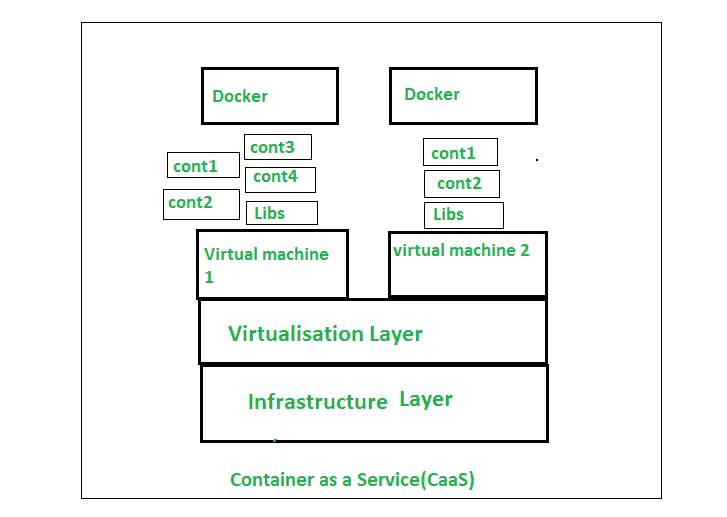

# 集装箱即服务(CaaS)

> 原文:[https://www.geeksforgeeks.org/container-as-a-service-caas/](https://www.geeksforgeeks.org/container-as-a-service-caas/)

**什么是容器:**
容器是一个可用的软件单元，其中插入了应用程序代码以及库和它们的依赖关系，同样，它们可以在任何地方运行，无论是在桌面上、传统 it 上还是云中。
为此，容器利用虚拟操作系统(OS)，其中在 CPU 分区、内存和磁盘访问过程中都使用 OS 特性(在 Linux 内核的情况下，它们是域名和域组的名字)。

**容器即服务(CaaS) :**
容器即服务(CaaS)是一种云服务模式，允许用户上传、编辑、启动、停止、评级和以其他方式管理容器、应用程序和集合。它通过基于工具的虚拟化、编程接口或门户网站接口来实现这些过程。CaaS 帮助用户通过本地或云数据中心创建丰富、安全和分散的应用程序。容器和集合在此模型中用作服务，并安装在站点的云或数据中心。
CaaS 帮助开发团队高效地部署和管理系统，同时提供比 PaaS 允许的更多的容器编排控制。

容器即服务(CaaS)是云服务的一部分，服务提供商授权客户管理和分发包含容器和集合的应用程序。CaaS 有时被认为是云服务交付的一种特殊的基础设施即服务(IaaS)模型，但是在更大的资产是容器的地方，有虚拟机和物理硬件。

**集装箱即服务(CaaS)的优势:**

*   容器和 CaaS 使得部署和设计分布式应用程序或构建更小的服务变得更加容易。
*   在开发过程中，容器的集合可能处理不同的职责或不同的编码环境。
*   容器之间的网络协议关系可以定义并绑定到转发。
*   CaaS 承诺这些定义的和专用的容器结构可以在云捕获中快速部署。
*   举个例子，想象一个用微服务设计的假软件程序，其中服务计划是用业务域标识组织的。服务域可以是:支付、认证和购物车。
*   使用 CaaS，这些应用程序容器可以立即发送到一个实时系统。
*   发布安装在 CaaS 平台上的应用程序，使用日志集成和监控等工具实现程序性能。
*   CaaS 还包括内置的自动测量性能和编排管理。
*   它使团队能够快速构建高可见性和分布式系统以实现高可用性。
*   此外，CaaS 通过支持更快的部署来增强团队发展。
*   容器用于防止定向部署，而 CaaS 可以通过减少管理部署所需的 DevOps 资源来降低工程运营成本。

**集装箱即服务(CaaS)的缺点:**

*   根据提供商的不同，可用的技术也有限制。
*   从云中提取业务数据是危险的。

**安全问题:**

*   容器被认为比微软机器等同类产品更安全，但也有一些风险。
*   尽管它们是不可知的平台，但容器与操作系统共享相同的内核。
*   这使得容器有被攻击的风险。
*   随着容器通过 CaaS 部署在云中，风险呈指数级增长。

**性能限制:**

*   容器是可见区域，不直接在裸露的金属上运行。
*   裸机和应用程序容器及其字符之间的额外层有所缺失。
*   将此与托管计划相关联的容器的网络丢失结合起来；结果是性能显著下降。
*   因此，即使有高质量的硬件可用，企业也必须在容器的功能方面面临一些损失。
*   因此，有时最好使用裸机程序来测试应用程序的全部潜力。

【CaaS 是如何工作的？

容器即服务是一种计算和可访问的计算机云。用户用来在云平台上上传、创建、管理和部署基于容器的应用程序。基于云的环境连接可以使用图形界面或通过应用编程接口调用来实现。整个 CaaS 平台的本质是一个编排工具，支持复杂容器结构的管理。编排工具在活动容器之间进行组合，并支持自动化操作。CaaS 框架中现有的编排器对服务用户提供的服务有直接影响。

**为什么容器很重要:**

*   在容器的帮助下，应用程序代码可以打包，这样我们就可以在任何地方运行它。
*   有助于促进多个平台之间的可移植性。
*   有助于更快地发布产品。
*   提高开发和部署创新解决方案以及构建分布式系统的效率。

**为什么 Caas 重要:**

*   帮助开发人员开发完全扩展的容器以及应用程序部署。
*   有助于简化容器管理。
*   有助于自动化关键的信息技术功能，如谷歌库本内斯和码头工人。
*   有助于提高团队开发速度，从而实现快速开发和部署

**结论:**

许多工业家对容器发誓是有原因的。集装箱带来的好处远远大于任何坏处。易操作性、资源友好性、优雅性和可移植性使它成为编码界的宠儿。