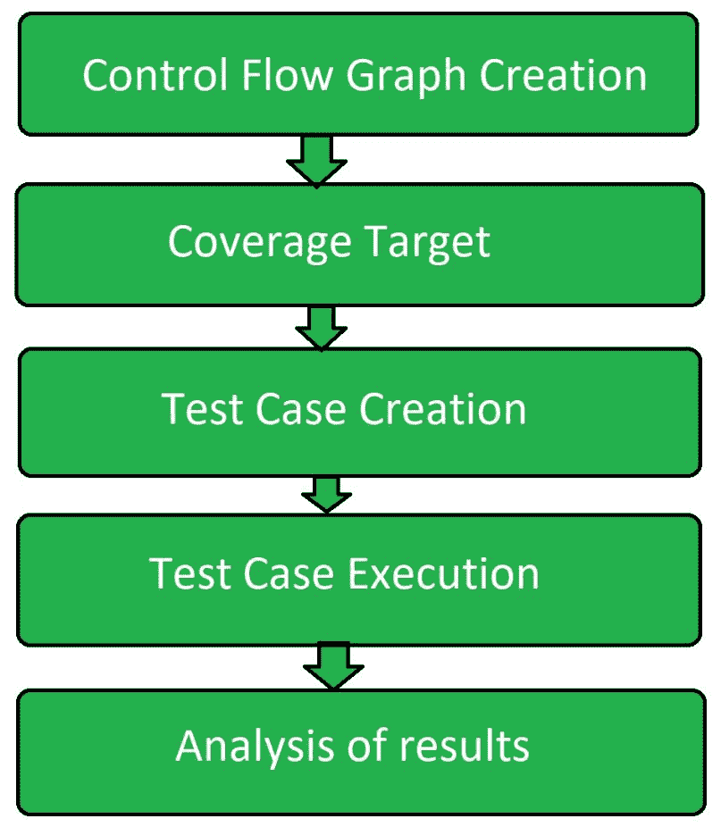

# 控制流程软件测试

> 原文:[https://www . geesforgeks . org/control-flow-software-testing/](https://www.geeksforgeeks.org/control-flow-software-testing/)

**控制流测试**是一种以程序的控制流为模型的[软件测试](https://www.geeksforgeeks.org/software-testing-basics/)。控制流测试是一种结构测试策略。这种测试技术属于白盒测试。对于控制流测试的类型，测试团队应该知道软件的所有结构、设计、代码和实现。

这种类型的测试方法经常被开发人员用来测试自己的代码和自己的实现作为设计，代码和实现对开发人员来说是更好的了解。实现这种测试方法的目的是测试代码的逻辑，以便满足用户需求。它的主要应用是把小程序和大程序的片断联系起来。

**控制流测试流程:**
以下是控制流测试流程中涉及的步骤:



*   **控制流图创建:**
    根据给定的源代码，手动或使用软件创建控制流图。
*   **覆盖目标:**
    覆盖目标是在控制流图上定义的，包括节点、边、路径、分支等。
*   **测试用例创建:**
    使用控制流图创建测试用例，以覆盖定义的覆盖目标。
*   **测试用例执行:**
    在覆盖目标之上创建测试用例之后，执行进一步的测试用例。
*   **分析:**
    对结果进行分析，找出程序是否没有错误或者有一些缺陷。

**[【控制流图】](https://www.geeksforgeeks.org/software-engineering-control-flow-graph-cfg/) :**
控制流图是在程序执行期间完成的控制流或计算的图形表示。控制流图主要用于静态分析以及编译器应用程序，因为它们可以准确地表示程序单元内部的流。控制流图最初是由法兰西斯·E·艾伦开发的。

**[圈复杂度](https://www.geeksforgeeks.org/cyclomatic-complexity/) :**
圈复杂度是其中线性独立路径数量的量化度量。它是一种用来描述程序复杂性的软件度量。它是使用程序的控制流图计算的。

```
M = E - N + 2P 
```

**控制流测试的优势:**

*   它检测到了在单元测试中确定的几乎一半的缺陷。
*   这也决定了整个程序几乎三分之一的缺陷。
*   它可以手动或自动执行，因为所使用的控制流程图可以手动或使用软件制作。

**控制流测试的缺点:**

*   如果程序和模型是由同一个人完成的，很难找到遗漏的路径。
*   不太可能发现虚假特征。