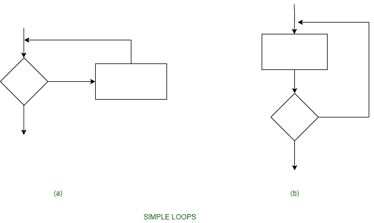
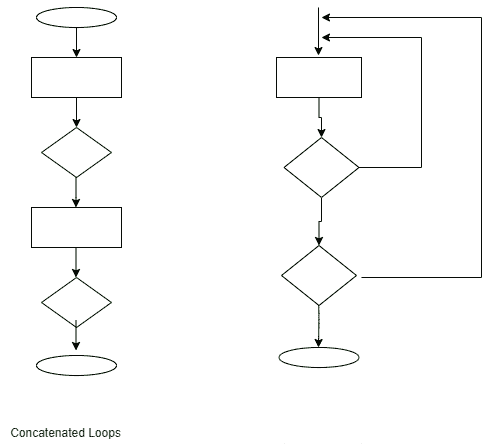
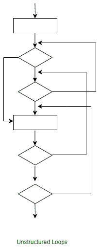

# 控制结构测试

> 原文:[https://www.geeksforgeeks.org/control-structure-testing/](https://www.geeksforgeeks.org/control-structure-testing/)

控制结构测试用于通过测试程序中存在的各种控制结构来增加覆盖区域。在控制结构测试下进行的不同类型的测试如下-

```
1. Condition Testing 
2. Data Flow Testing
3. Loop Testing 
```

**1。条件测试:**
条件测试是一种测试用例设计方法，它确保逻辑条件和决策语句没有错误。逻辑条件中出现的错误可能是不正确的布尔运算符、布尔表达式中缺少括号、关系运算符和算术表达式中的错误等等。

使用条件测试进行测试的常见逻辑条件类型有-

1.  一种关系表达式，如 E1 运算式 E2，其中“E1”和“E2”是算术表达式，“运算式”是运算符。
2.  一个简单的条件，就像前面带有 NOT (~)运算符的任何关系表达式一样。
    例如，(~E1)，其中‘E1’是算术表达式，‘a’表示 NOT 运算符。

*   复合条件由两个或多个简单条件、布尔运算符和括号组成。
    例如，(E1 & E2)|(E2 & E3)，其中 E1、E2、E3 表示算术表达式，而“&”和“|”表示 and 或 or 运算符。*   A Boolean expression consists of operands and a Boolean operator like ‘AND’, OR, NOT.
    For example, ‘A|B’ is a Boolean expression where ‘A’ and ‘B’ denote operands and | denotes OR operator.

    **2。数据流测试:**
    数据流测试方法根据定义的位置选择程序的测试路径，并使用程序中的所有变量。

    数据流测试方法描述如下:假设程序中的每个语句都被分配了一个唯一的语句号，并且主题函数不能修改其参数或全局变量。
    例如，以 S 为其语句号。

    ```
    DEF (S) = {X | Statement S has a definition of X}
    USE (S) = {X | Statement S has a use of X} 
    ```

    如果语句 S 是 If 循环语句，那么它的 DEF 集是空的，它的 USE 集取决于语句 S 的状态。语句 S 处变量 X 的定义称为语句 S '的行。如果语句是从 S 到语句 S '的任何一种方式，那么 X 就没有其他定义

    变量 X 的定义使用(DU)链的形式为[X，S，S']，其中 S 和 S '表示语句号，X 在 DEF(S)和 USE(S ')中，语句 S 中 X 的定义是语句 S '处的行。

    简单的数据流测试方法要求每个 DU 链至少被覆盖一次。这种方法被称为 DU 测试方法。DU 测试不能确保覆盖程序的所有分支。

    然而，只有在 rar 的情况下，一个分支不能保证被 DU 测试所覆盖，例如当另一个结构在它的后面部分没有任何变量的确定性，并且另一个部分不存在时。数据流测试策略适用于选择包含嵌套 if 和循环语句的程序的测试路径。

    **3。回路测试:**
    回路测试实际上是一种白盒测试技术。它特别关注循环构造的有效性。
    以下是循环的类型。

    1.  **Simple Loop –** The following set of test can be applied to simple loops, where the maximum allowable number through the loop is n.
        1.  跳过整个循环。
        2.  仅遍历循环一次。
        3.  遍历循环两次。
        4.  使 p 通过 p
        5.  遍历循环 n-1，n，n+1 次。

        

    2.  **Concatenated Loops –** If loops are not dependent on each other, contact loops can be tested using the approach used in simple loops. if the loops are interdependent, the steps are followed in nested loops.

        

    3.  **嵌套循环–**循环中的循环称为嵌套循环。测试嵌套循环时，测试的数量会随着级别嵌套的增加而增加。
        测试嵌套循环的步骤如下-
        1.  从内环开始。将所有其他循环设置为最小值。
        2.  对内环进行简单的环路测试。
        3.  向外工作。
        4.  继续，直到测试完所有循环。
    4.  **Unstructured loops –** This type of loops should be redesigned, whenever possible, to reflect the use of unstructured the structured programming constructs.

        