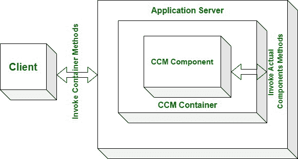

# CORBA 组件模型(CCM)

> 原文:[https://www.geeksforgeeks.org/corba-component-model-ccm/](https://www.geeksforgeeks.org/corba-component-model-ccm/)

**CCM** 通过定义元素和产品来扩展 **CORBA 对象模型**，这些元素和产品允许实用程序开发人员在一般环境中实现、管理、配置和部署结合了通常使用的 CORBA 服务的组件，例如事务、安全、持久状态和事件通知服务。CCM 规范是向后的，非常适合旧的 CORBA 规范。CCM 是用于构建和部署 CORBA 应用程序的服务器端组件模型。

它为不断增长的分布式 n 层中间件提供了恒定的组件结构框架。给写在 CCM 规范 CORBA 组件中的元素命名是诚实的。CCM 的关键因素如下:

1.  它是企业 JavaBeans 的扩展。
2.  它保证了当前 EJB 解决方案的完全兼容嵌入。
3.  它是语言和平台无关的。

**CCM 的特点:**

1.  **Portable Object Adapter –**
    The major function of CORBA object adapter is to act as mediator or you can say to mediate between ORB and object receiving incoming calls and returning results. Portable object adapter having its instance which accepts requests on behalf of group of objects.
2.  **CCM Components –**
    A CCM utility is assembly of CCM components, each of which may additionally be custom-built. Made to particular customer’s order or Commercial off-the-shelf or commercially available off-the-shelf (COTS).

    CCM 组件进一步分为 4 种类型:

    *   **(i)会话组件:**
        会话组件的实例在跨国会话期间保持状态，并在这样的会话中启用呼叫对。
    *   **(ii)服务组件:**
        服务组件在每次来电时都会实例化，因此无法在整个通话过程中保持状态。
    *   **(iii)过程组件:**
        过程组件的实例具有连续状态——它们的寿命对应于它们所服务的某个过程的寿命。
    *   **(iv)实体组件:**
        实体组件最终会有对应于某个数据库中实体的持久实例——它们可以通过提供数据库实体的主键来访问。

    CCM 中有一些端口，分为不同的类型，如刻面、插座、匹配源等。面是提供的接口，插座是必需的接口。组件实例的容器链接到其他实例的方面。事件源和接收器是相似的，但是它们不是相互链接，而是都链接到事件通道。

    容器提供连接和断开操作，并在内部对应于其他合适类型对象的对象引用。为了支持 CCM 中任何新组件的初始配置，使用了配置接口。

3.  **CCM Container –**
    To start the further process every CCM component which is component of instance of CCM is positioned inside CCM container. Components engage with POA as well as transactions, security, persistence, and notification offerings by means of interfaces on their container. A container additionally has receptacles that receive callbacks into component instance. Transaction manage can be container-managed or self-managed.

    在容器管理的情况下，组件配置说明事务是受支持的、必需的、新的还是不再受支持的。为了管理所有这些请求，容器将相应地停止和启动事务处理。同样，我们可以将持久性声明为自我管理。或者可以声明为容器管理的。