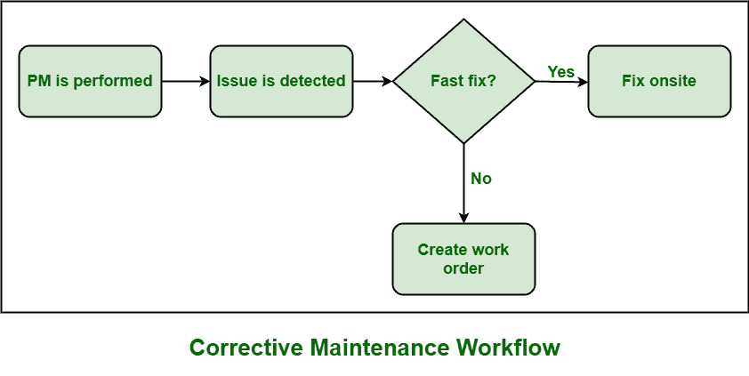

# 纠正性维护(CM)

> 原文:[https://www.geeksforgeeks.org/corrective-maintenance-cm/](https://www.geeksforgeeks.org/corrective-maintenance-cm/)

**纠正性维护(CM)** 顾名思义，就是用来将某个事物纠正到其正常工作状态的维护策略。无论何时任何设备或资产出现故障，都需要确定主要问题，然后决定特定设备是否需要维修或更换。CM 是一种维护策略，当一项资产，即设备、部件、设备的一部分等，通常需要它。出现故障或停止工作或受到损坏，只是为了让资产恢复正常工作状态。

资产可以通过更换或修复来纠正。其主要目的通常是修复损坏的资产或设备。可以说，它基本上是一个主要在发生故障或故障后实施的整改过程。CM 也可以作为更广泛策略的一部分来规划你的维护策略。
出现这种维护的情况有几种:

*   只要使用状态监控检测到任何问题。
*   每当例行检查中发现潜在故障时。
*   每当资产或设备出现故障或故障时。

**纠正性维护的目标:**

*   CM 的主要目的是防止生产损失。为了防止生产损失，CM 只是将设备或资产恢复到正常工作状态，以减少对生产的影响。设备故障会影响生产成本、产品质量、客户满意度。
*   CM 的另一个主要目标是有效地修复每台出现故障的设备。CM 必须进行适当次数的维修，直到故障设备被买回来恢复工作状态。
*   另一个目标是在每次设备故障时管理适当的维修成本。
*   另一个目标就是减少未来失败的机会。CM 只是确保避免任何将来可能更严重的突然失败。
*   另一个目标是管理备份设备所需的更换成本。

**纠正性维护(CM)的基本特征:**

*   CM 既可以是计划的，也可以是非计划的。
*   在这种维护策略中，维护任务仅在故障或故障发生后以及在给定的开采周期内分配。
*   需要纠正的失败应该不那么严重。只有在故障维护性质不太严重的情况下，CM 才有效。
*   纠正性维护通过简单地纠正特定设备故障并使设备恢复正常工作状态，确保该故障不会影响整体生产损失。

**什么时候用 CM？**
很明显，在某些时候，资产或设备通常会出现故障。维护团队通常执行维护任务，以便维修或更换故障设备。主要的问题是什么时候应该使用 CM 而不是另一种维护策略，因为现在有很多维护策略可用。

选择 CM 的决定主要取决于出现问题时设备的修复速度、特定资产的可靠性、停机成本。有时，执行纠正性维护可能比其他类型的维护成本更高。但是对一个人来说，通过执行预防性维护而不是执行纠正性维护来防止设备故障更好。