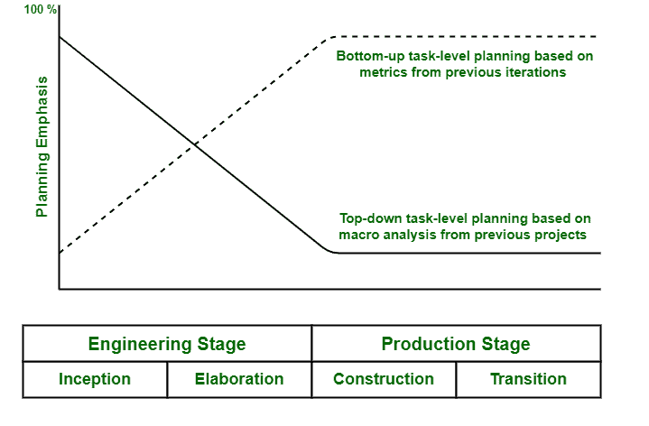

# 成本和进度估算流程

> 原文:[https://www . geesforgeks . org/成本和进度估算流程/](https://www.geeksforgeeks.org/cost-and-schedule-estimating-process/)

成本和进度估算过程有助于确定完成所有项目活动所需的资源数量。它通常涉及计划、执行或工作、交付或给出项目的成本替代方案的近似和开发。一个好的估计对于保持项目在预算之内是非常重要的。

导出项目计划通常需要两个视角。这些观点如下:

1.  **前瞻:**
    *   前瞻性方法也称为自上而下方法。这种方法通常从描述和解释各种项目任务开始，包括从项目目标或最终可交付成果开始，并将其分解成更小的计划块。
    *   自上而下预算也指项目经理为组织编制高水平预算的预算方法。
    *   这些项目经理或高级管理人员开发并创建对软件项目至关重要的总体规模、过程、环境、人员和质量的特征描述。在这种方法中，可交付成果的持续时间是估计的。
    *   它通常比自下而上的估计花费更少的时间和精力。借助软件成本估算模型，对总体工作量和进度进行估算。项目经理通常将总体工作的评估划分到工作分解结构的顶层。
    *   他们还将时间表划分为主要的里程碑日期。在这一阶段，子项目经理只需负责在顶层、人员配置和主要里程碑日期的各种分配作为约束的帮助下，将工作分解结构的每个元素分解成更低的级别。
    *   这种方法的主要好处是使用早期项目或产品的整体数据，以及未减轻的风险和范围扩展。这也有助于降低被忽视的工作活动或成本的风险。
2.  **Backward-Looking :**
    *   后视方法也称为自下而上方法。
    *   在这种方法中，项目团队分解客户的需求，确定适合开发一系列评估的最低级别，根据可用的任务定义覆盖项目的整体范围。
    *   最低级别工作分解结构的总体要素通常解释为详细的任务，工作分解结构要素经理负责估算预算和进度。
    *   所有这些评估都被加入并集成到更高级别的 WBS 预算和里程碑中。

    借助自上而下的方法，里程碑调度也称为预算分配，会产生一个高度乐观的计划。然而，自下而上的方法会导致非常悲观的计划。迭代是非常需要和重要的，使用一种方法的结果来验证甚至检查另一种方法的结果。这两种方法应该在项目的整个生命周期中一起使用，如下所示。

    下图显示了整个生命周期的计划平衡。

    

    **工程阶段规划强调以下几点:**

    *   工程工件的宏观任务评估。
    *   生产阶段工件的宏观任务评估。
    *   利益相关者同意。
    *   实际支出与计划支出的粗粒度差异分析。
    *   将自上而下的独立于项目的规划指南调整为特定于项目的规划指南。
    *   WBS 定义和阐述。

    **生产阶段规划强调以下几点:**

    *   生产阶段工件的宏观任务评估。
    *   工程工件维护的宏观任务评估。
    *   利益相关者同意。
    *   实际支出与计划支出的粗粒度差异分析。

    自上而下的视角一般在工程阶段占主导地位。这是因为没有足够的理解深度或细节，甚至在执行自下而上方法规划的详细任务序列中也不稳定。另一方面，有足够的前期经验和规划保真度，自下而上的规划视角在生产阶段占主导地位。