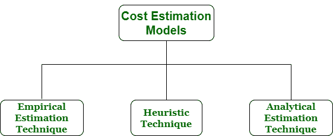

# 软件工程中的成本估算模型

> 原文:[https://www . geesforgeks . org/成本估算-软件工程中的模型/](https://www.geeksforgeeks.org/cost-estimation-models-in-software-engineering/)

**成本估算**简单来说就是一种用来找出成本估算的技术。成本估算是在[软件工程](https://www.geeksforgeeks.org/software-engineering/)中开发和测试软件的财务支出。成本估算模型是用于估算产品或项目成本的一些数学算法或参数方程。

各种技术或模型可用于成本估算，也称为成本估算模型，如下所示:

1.  **Empirical Estimation Technique –**
    Empirical estimation is a technique or model in which empirically derived formulas are used for predicting the data that are a required and essential part of the software project planning step. These techniques are usually based on the data that is collected previously from a project and also based on some guesses, prior experience with the development of similar types of projects, and assumptions. It uses the size of the software to estimate the effort.

    在这种技术中，对项目参数进行有根据的猜测。因此，这些模型是基于常识的。然而，由于经验估计技术涉及许多活动，所以这种技术是形式化的。例如德尔菲法和专家判断法。

2.  **Heuristic Technique –**
    Heuristic word is derived from a Greek word that means “to discover”. The heuristic technique is a technique or model that is used for solving problems, learning, or discovery in the practical methods which are used for achieving immediate goals. These techniques are flexible and simple for taking quick decisions through shortcuts and good enough calculations, most probably when working with complex data. But the decisions that are made using this technique are necessary to be optimal.

    在这种技术中，不同项目参数之间的关系用数学方程表示。流行的启发式技术是由[建设性成本模型(COCOMO)](https://www.geeksforgeeks.org/software-engineering-cocomo-model/) 给出的。这种技术也用于增加或加快分析和投资决策。

3.  **Analytical Estimation Technique –**
    Analytical estimation is a type of technique that is used to measure work. In this technique, firstly the task is divided or broken down into its basic component operations or elements for analyzing. Second, if the standard time is available from some other source, then these sources are applied to each element or component of work.

    第三，如果没有这样的时间，那么工作是根据工作经验来估计的。在这种技术中，结果是通过对项目做出某些基本假设而得出的。因此，分析估计技术具有一定的科学依据。[霍尔斯特德的](https://www.geeksforgeeks.org/software-engineering-halsteads-software-metrics/)软件科学是基于一个分析估计模型。