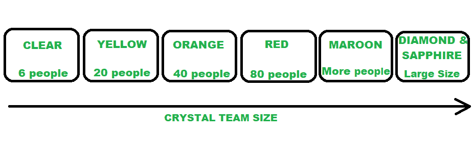

# 敏捷开发/框架中的水晶方法

> 原文:[https://www . geesforgeks . org/crystal-methods-in-agile-development-framework/](https://www.geeksforgeeks.org/crystal-methods-in-agile-development-framework/)

先决条件:[敏捷开发](https://www.geeksforgeeks.org/software-engineering-agile-development-models/)

**敏捷开发/框架中的水晶方法:**
水晶方法是一个敏捷框架，它被认为是一种轻量级或敏捷的方法，关注个人和交互。这些方法用颜色标记，以表示对人类生命的威胁。它主要用于短期项目，由一组开发人员在一个工作空间中工作。在为数不多的敏捷[软件开发生命周期(SDLC)](https://www.geeksforgeeks.org/software-development-life-cycle-sdlc/) 模型中，crystal 被认为是敏捷 SDLC 模型之一。
水晶法的两个核心信念:

*   找到自己优化工作流程的方法和途径。
*   利用独特的方法，使项目独特而充满活力。

**让我们了解一下水晶法**的历史:
水晶法是由一位在 IBM 工作的美国科学家阿利斯泰尔·考克伯恩发明的。他决定不关注循序渐进的发展战略，而是发展团队协作和沟通。考克伯恩水晶法的一些特点是:

*   人力驱动，即项目应该是灵活的，人们更喜欢参与工作。
*   适应性，即方法没有任何固定的工具，但可以，但可以随时改变，以满足团队的特定需求。
*   超轻，即这种方法不需要太多文档。

**水晶敏捷框架属性:**

1.  **频繁交付-**
    它可以让你定期将产品、测试代码交付给真实用户。没有这些，你可能会制造出一个没人需要的产品。
2.  **反思性改进-**
    不管你做得多好，做得多差。因为总有产品可以改进的地方，所以团队可以实施来改进他们未来的实践。
3.  **渗透沟通-**
    阿利斯泰尔说，让团队处于同一物理阶段非常重要，因为它允许信息在团队成员之间流动，就像在渗透中一样。
4.  **人身安全-**
    水晶团队没有不好的建议，团队成员应该毫无畏惧地公开讨论想法，感到安全。
5.  **专注-**
    团队中的每个成员都知道该做什么，这使他们能够集中注意力。这促进了团队互动，并朝着同一个目标努力。
6.  **轻松访问专家用户-**
    增强与用户的团队沟通，定期获得真实用户的反馈。
7.  **技术工具-**
    它包含非常具体的技术工具，供软件开发团队在测试、管理和配置过程中使用。这些工具使团队能够在更短的时间内识别任何错误。

**水晶是如何运作的？**
直到现在，我们才知道 crystal 是一个多种发育途径的家族，它不是一组规定的发育工具和方法。在开始时，通过考虑业务需求和项目的需求来设置方法。Crystal 系列中的各种方法也称为 Crystal 方法的权重，由光谱的不同颜色表示。
水晶家族由水晶透明、水晶黄色、水晶红色、水晶蓝宝石、水晶红色、水晶橙色网、水晶钻石等多种变体组成。

1.  **晶莹剔透-**
    该团队仅由 1-6 名成员组成，适合成员在单一工作区工作的短期项目。
2.  **水晶黄-**
    它有一个 7-20 人的小团队规模，反馈来自真实用户。这种变体涉及自动化测试，可以更快地解决错误并减少过多文档的使用。
3.  **水晶橙-**
    团队规模 21-40 人，团队根据功能技能进行拆分。这里的项目一般持续 1-2 年，需要每 3 到 4 个月发布一次。
4.  **水晶橙网-**
    它也有 21-40 名成员的团队规模，项目有一个不断发展的代码库，供公众使用。它也类似于 Crystal Orange，但在这里，它们不处理单个项目，而是需要编程的一系列计划。
5.  **晶红-**
    软件开发由 40-80 人领导，可以根据需求组建团队，进行分工。
6.  **Crystal Maroon-**
    涉及大型项目，团队规模为 80-200 人，方法不同，根据软件要求。
7.  **水晶钻石&蓝宝石-**
    该变体用于对人类生命存在潜在风险的大型项目。

下图说明了关于水晶团队

水晶家族(团队成员)

**使用水晶敏捷框架的好处:**

*   促进和加强团队沟通和责任。
*   适应性方法让团队能够很好地响应苛刻的需求。
*   允许团队与他们认为最有效的人合作。
*   团队之间直接对话，减少了管理开销。

**使用水晶敏捷框架的缺点:**

*   缺乏预先定义的计划可能会导致混乱和失去重点。
*   缺乏结构可能会拖慢没有经验的团队。
*   不清楚远程团队如何非正式地分享知识。

水晶法是可扩展的。它可以被小团队或大团队用来处理简单或复杂的对象。它重视发展技能，互动反过来鼓励思想交流。它也有利于客户，因为它首先交付产品的最重要的组成部分。但另一方面，水晶方法并不是根据项目的需求来规划的。