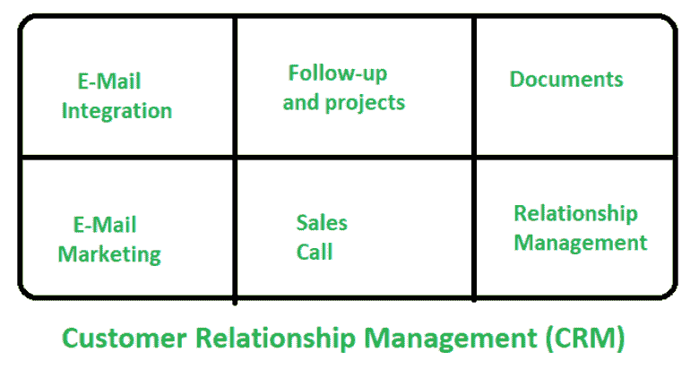

# 客户关系管理(CRM)

> 原文:[https://www . geesforgeks . org/customer-relationship-management-CRM/](https://www.geeksforgeeks.org/customer-relationship-management-crm/)

**客户关系管理**就是寻找客户。一路上收集他们的信息，并利用这些信息来增强他们的经验和培养长期关系。基本上，这是一个建立和维护与客户关系的过程。

客户关系管理涉及电子邮件营销和集成、文档、销售电话、关系管理等。

**CRM 的作用:**

*   它提出了大胆的愿望，即发展关系的明确愿景。
*   它设定并执行客户关系策略。
*   它创建、管理和领导团队。

**客户关系管理的功能:**

*   获取和存储信息。
*   增加销量。
*   提高质量。
*   客户管理。
*   适当的通信网络。

**CRM 的优势:**

*   当客户获得良好的客户服务并继续做生意时，他们会一次又一次地返回。
*   它使组织能够创建详细的配置文件，如客户喜欢/不喜欢。
*   它降低了成本。
*   它凸显了糟糕的运营流程。
*   它增加了对市场和竞争对手信息来源的访问。

**CRM 的劣势:**

*   云中的安全和隐私。
*   有限的控制和灵活性。
*   脆弱性增加。
*   它需要额外的管理来维护。
*   这可能会导致任务重复。