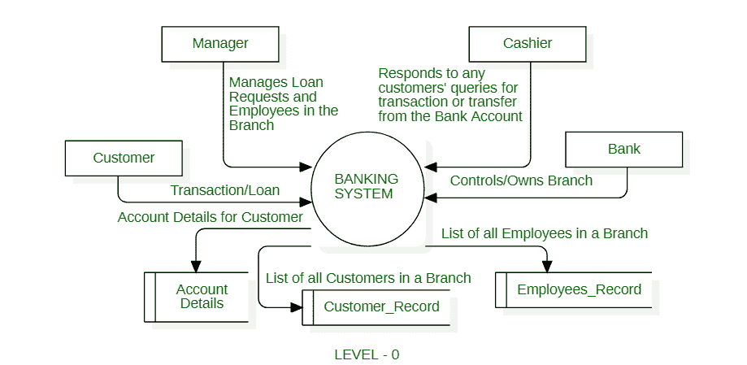
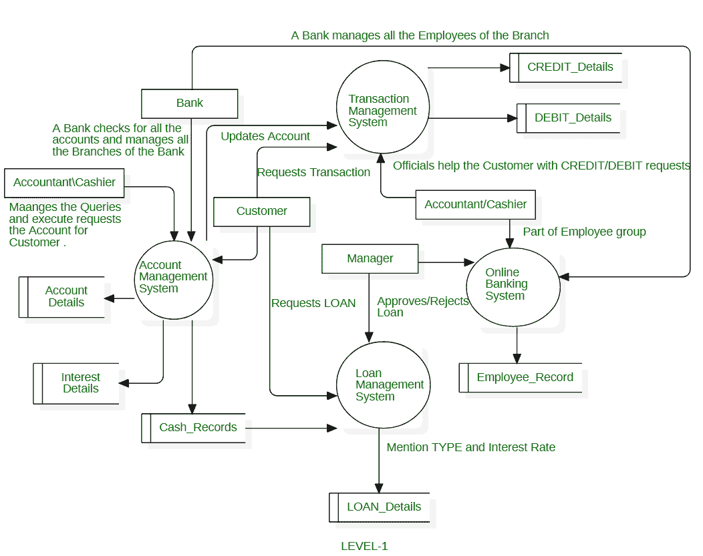
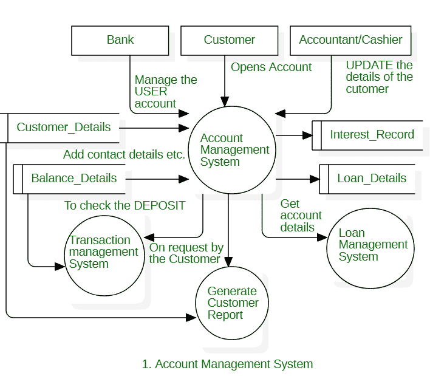
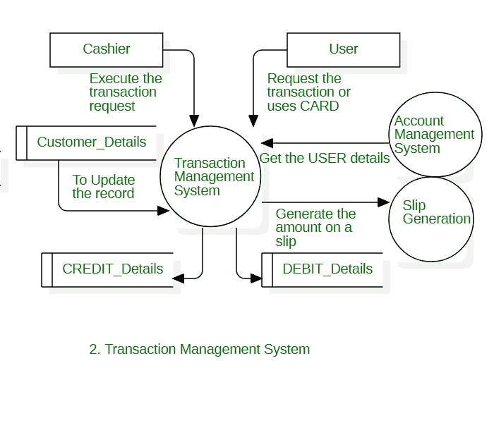
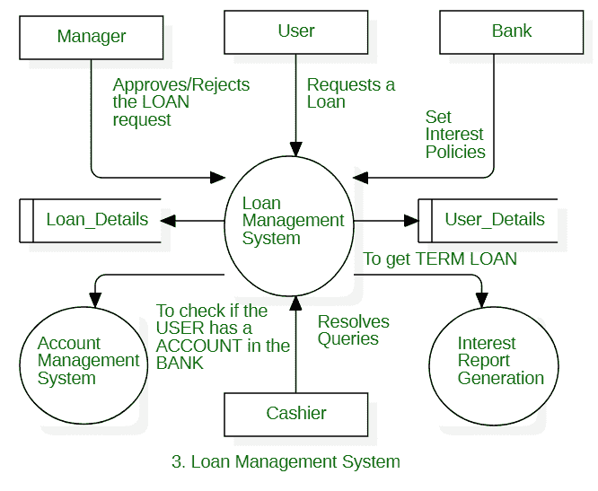
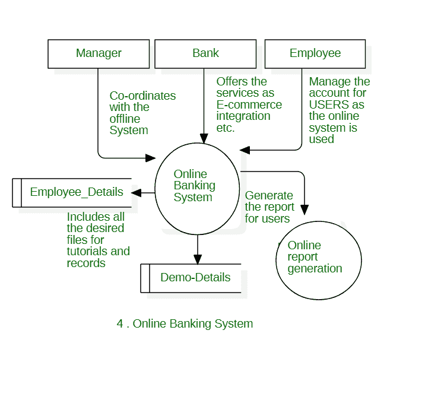

# 网银系统数据流图

> 原文:[https://www . geesforgeks . org/data-flow-diagram-for-online-banking-system/](https://www.geeksforgeeks.org/data-flow-diagram-for-online-banking-system/)

[数据流图](https://www.geeksforgeeks.org/what-is-dfddata-flow-diagram/)用于通过一组特定的图形表示来表示数据流以及在系统的各个组件之间以及系统和系统环境之间存储、操作和分发数据所涉及的过程和功能。它还描述了系统中信息的逻辑流动，并适当地定义和确定了系统构建的物理需求。数据流图的关键特征包括符号的简单性以及生成系统的手动和自动需求的清晰概述。
该系统描述如下

0 级 DFD——网上银行系统

**说明:**

1.  **交易请求/贷款请求–**
    在本例中，客户提供发起或支持交易的具体细节，客户可以通过系统申请贷款。
2.  **经理–**
    经理可以访问和管理任何请求，也可以输入命令来更改或更新 Employee_Record 数据库。经理管理银行的员工，接受或拒绝任何贷款请求，并因此输入详细信息来更新相应的数据库，如客户记录和员工记录数据库。
3.  **收银员–**
    **主动响应任何交易请求并协助经理。收银员还可以解决客户的任何疑问，并立即为客户提供帮助。但是，收银员不能独立访问任何数据库。**
4.  ****银行总部–**
    它作为一个实体控制着银行的所有分支机构。该实体可以访问所有数据库，并且还控制管理器的操作。本行可以修改或删除任何政策，也可以为网上银行系统创建新政策。**
5.  ****Customer _ Record–**
    它存储银行任何特定分行的客户的所有非个人详细信息。当个人发起在银行开户的请求时，Customer_Records 会创建一个新条目，该条目是唯一的，并且仅针对客户。当需要时，银行经理或员工可以访问该记录。**
6.  ****员工 _ 记录–**
    存储银行所有员工的记录。银行的客户可以访问该记录，但不能修改。该记录可由分行经理或银行自己修改。**
7.  ****Account _ Details–**
    It**存储每个客户的个人详细信息。它只能由客户访问/修改。银行不能修改客户的个人信息。****

****

一级 DFD-网上银行系统**** 

******流程:******

1.  ******账户管理系统–**
    在该系统中，客户可以通过添加其详细信息来访问银行提供的所有服务。当客户以交易或贷款的形式获得任何服务时，所需的数据将分别流向交易管理系统或贷款管理系统。任何客户都可以使用生成客户报告系统打印从所有可用数据库中获取信息的帐户的活动状态。****
2.  ******交易管理系统–**
    它帮助客户向另一个账户添加/转账。收银员可以代表银行执行或帮助执行交易流程，银行会在交易成功后更新与客户相关的所有相应详细信息。****
3.  ******贷款管理系统–**
    客户向银行申请或请求贷款时使用。经理可以访问贷款详细信息数据库，以接受或拒绝贷款请求。本行有权修改贷款管理系统，因为本行可以设置或修改本行提供的任何贷款政策。****
4.  ******网银系统–**
    提供保险、票据支付等其他服务。****

****网上银行系统的二级数据流图如下****

****

二级 DFD–账户管理系统**** ****

二级 DFD 交易管理系统**** ****

二级 DFD 贷款管理系统**** ****

二级 DFD 贷款管理系统**** 

****因此，数据流图清楚地代表了系统设计中的信息流或数据流。****