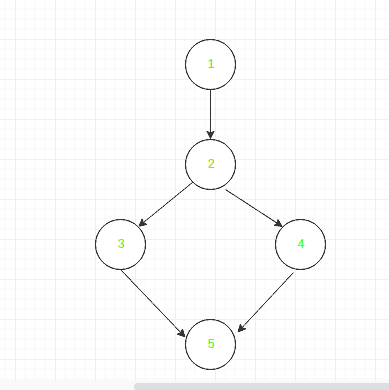

# 数据流测试

> 原文:[https://www.geeksforgeeks.org/data-flow-testing/](https://www.geeksforgeeks.org/data-flow-testing/)

**数据流测试**是一种结构测试。它是一种根据程序中变量的定义和使用位置来寻找程序测试路径的方法。与数据流图无关。
它关心的是:

*   变量接收值的语句，
*   使用或引用这些值的语句。

为了说明数据流测试的方法，假设程序中的每个语句都分配了一个唯一的语句号。对于报表编号 S-

```
DEF(S) = {X | statement S contains the definition of X}
USE(S) = {X | statement S contains the use of X} 
```

如果一个语句是循环或 If 条件，那么它的 DEF 集是空的，USE 集是基于语句的条件的。

数据流测试使用控制流图来查找可能中断程序流的情况。
在值和变量之间关联时，检测数据流中的参考或定义异常。这些异常情况是:

*   变量已定义，但未被使用或引用，
*   变量被使用但从未被定义，
*   变量在使用前要定义两次

**数据流测试的优势:**
数据流测试用于发现以下问题-

*   要查找已使用但从未定义的变量，
*   要找到一个已定义但从未使用过的变量，
*   要查找在使用前定义了多次的变量，
*   在使用变量之前解除分配。

**数据流测试的缺点**

*   耗时且昂贵的过程
*   需要编程语言知识

**示例:**

```
1. read x, y;
2. if(x>y)
3. a = x+1
else
4. a = y-1
5. print a; 
```

**上例控制流程图:**



**定义/使用上述示例的变量:**

<center>

| 可变的 | 在节点处定义 | 用于节点 |
| --- | --- | --- |
| x | one | 2, 3 |
| y | one | 2, 4 |
| a | 3, 4 | five |

</center>