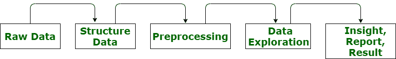

# 数据预处理及其类型

> 原文:[https://www . geeksforgeeks . org/data-预处理及其类型/](https://www.geeksforgeeks.org/data-preprocessing-and-its-types/)

预处理只是指执行一系列操作来转换或改变数据。它是在将数据输入算法之前对数据进行的转换。**数据处理**是指对数据进行操作，以检索、转换或改变数据，尤其是通过计算机。这是一种用于将原始数据转换为干净数据集的技术。

换句话说，无论何时从不同来源收集数据，都是以原始格式收集的，这对于分析来说是不可行的。然后，它将原始格式转换为可读格式(图形、文档等)。)，以便它可以被计算机解释并被整个组织的员工所利用。

**需要数据预处理:**

*   它将原始数据转化为有意义的信息。数据处理服务需要熟练的专业人员应用不同的技术进行分析和数据处理。
*   像机器学习这样的新技术高度依赖数据。由于数据是这些技术的核心，因此数据必须以技术更容易理解的方式或格式呈现。
*   它只是用于从应用模型中获得更好的结果。在 ML 中，数据的格式必须是正确的。某些指定的 ML 模型需要指定的格式。例如，随机森林算法不支持空值。因此，要执行随机森林算法，必须从原始数据集中管理空值。
*   数据集的格式应确保在一个数据集中执行多个最大似然和深度算法，然后从中选择最佳算法。
*   它提高了最大似然模型的准确性和效率，因为数据预处理需要清理数据的任务，并使其适合最大似然模型。
*   它提供并提高了最大似然模型的可推广性。对于任何 ML 应用程序，数据都是通过“传感器”收集的。使用的传感器可以是物理设备、仪器、许多软件程序，如网络爬虫、人工调查等。

**数据预处理技术类型:**

1.  **重新缩放数据–**
    当我们的数据主要由不同尺度的属性组成时，ML 算法可以受益于重新缩放属性。这意味着数据集的所有属性具有相同的尺度，因此数据集的测量参数保持一致。这也用于优化算法，以保持数据集的一致性。
2.  **二值化数据–**
    二值化是将任意实体的数据特征转化为二进制数的过程。这样做是为了更有效地对算法进行分类。为了转换成二进制，我们可以使用二进制阈值来转换数据。所有高于阈值的值都标记为 1，所有等于或低于阈值的值都标记为 0。这叫做二值化数据。当您有想要使 Crip 有价值的价值时，这可能会很有帮助。
3.  **Data Augmentation –**
    Data augmentation is strategy that allows practitioners or scientists to increase diversity of available data for training models, even without collecting or gathering new data. It simply means increasing amount of data with help of information available from training data. Sometimes, we need more data as many variations possible in data to get better generalization. But dataset is not big enough to capture variation. In such cases, Data augmentation is very helpful and plays very important role.

    下面给出了各种类型的数据扩充:

    *   **翻转:**
        我们可以水平或垂直翻转图像。有些框架不提供垂直功能。但是我们可以通过将图像旋转 180 度来执行垂直翻转，然后执行水平翻转。
    *   **缩放:**
        图像可以被缩放到外部世界或内部世界。当缩小世界时，最终图像的尺寸比原始图像长。在世界范围内缩放时，最终图像尺寸小于实际图像。
    *   **裁剪:**
        与缩放不同，我们只是从原始图像中随机选择部分。之后，我们将所选部分调整为原始图像大小。这种方法也被称为随机裁剪。
    *   **平移:**
        它只是涉及到沿 x 轴或 y 轴或两者移动图像。这种增强方法非常有用。这是因为对象几乎可以位于图像中的任何位置。