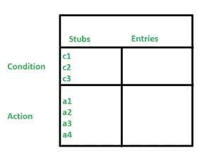

# 软件测试中基于决策表的测试

> 原文:[https://www . geesforgeks . org/decision-table-based-testing-in-software-testing/](https://www.geeksforgeeks.org/decision-table-based-testing-in-software-testing/)

**什么是决策表:**

决策表用于各种工程领域，以表示复杂的逻辑关系。这个测试是测试软件及其需求管理的一个非常有效的工具。输出可能取决于许多输入条件，决策表给出了输入条件各种组合的表格视图，这些条件的形式为真(T)和假(F)。此外，它还提供了测试中所需的一组条件及其相应的操作。

**决策表的部分:**

在 [**软件测试**](https://www.geeksforgeeks.org/software-testing-basics/) 中，决策表有 4 个部分，分为几个部分，如下所示:

1.  **条件存根:**条件列在决策表的第一个左上角，用于确定特定的操作或一组操作。
2.  **动作存根:**所有可能的动作都在决策表的第一个左下部分(即条件存根下方)给出。
3.  **条件条目:**在条件条目中，值被输入到决策表的右上部分。在表的条件条目部分，有多行多列，称为规则。
4.  **动作条目:**在动作条目中，每个条目在决策表的右下方都有一些关联的动作或动作集，这些值称为输出。

**决策表类型:**

决策表分为两种类型，如下所示:

1.  **受限条目:**在受限条目决策表中，条件条目被限制为二进制值。
2.  **扩展条目:**在扩展条目决策表中，条件条目有两个以上的值。决策表使用多个条件，其中一个条件可能有许多可能性，而不是只有“真”和“假”被称为扩展条目决策表。

**决策表的适用性:**

*   规则评估的顺序对结果操作没有影响。
*   决策表只能在单位一级轻松应用。
*   一旦一个规则被满足并且动作被选择，则需要检查另一个规则。
*   这些限制并没有消除许多应用。

**基于决策表的测试示例:**

下面是程序的判定表，用于确定三个数字中最大的一个，其中它的输入是正整数(x，y 和 z)的三倍，值来自区间[1，300]。

**表 1:三个数字中最大的决策表:**

<figure class="table">

| **条件** | **R1** | **R2** | **R3** | **R4** | **R5** | **R6** | **R7** | **R8** | **R9** | **R10** | **R11** | **R12** | **R13** | **R14** |
| c1: x > = 1？ | F | T | T | T | T | T | T | T | T | T | T | T | T | T |
| c2: x <= 300？ |   | F | T | T | T | T | T | T | T | T | T | T | T | T |
| c3: y > = 1？ |   |   | F | T | T | T | T | T | T | T | T | T | T | T |
| c4: x <= 300？ |   |   |   | F | T | T | T | T | T | T | T | T | T | T |
| c5: z > = 1？ |   |   |   |   | F | T | T | T | T | T | T | T | T | T |
| c6: z <= 300？ |   |   |   |   |   | F | T | T | T | T | T | T | T | T |
| c7: x>y？ |   |   |   |   |   |   | T | T | T | T | F | F | F | F |
| c8: y>z？ |   |   |   |   |   |   | T | T | F | F | T | T | F | F |
| c9: z>x？ |   |   |   |   |   |   | T | F | T | F | T | F | T | F |
| **规则计数** | Two hundred and fifty-six | One hundred and twenty-eight | Sixty-four | Thirty-two | Sixteen | eight | one | one | one | one | one | one | one | one |
| a1:无效输入 | X | X | X | X | X | X |   |   |   |   |   |   |   |   |
| a2 : x 是最大的 |   |   |   |   |   |   |   | X |   | X |   |   |   |   |
| a3 : y 最大 |   |   |   |   |   |   |   |   |   |   | X | X |   |   |
| a4 : z 最大 |   |   |   |   |   |   |   |   | X |   |   |   | X |   |
| 不可能 |   |   |   |   |   |   | X |   |   |   |   |   |   | X |

</figure>