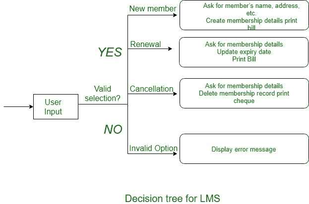

# 软件工程中的决策树

> 原文:[https://www . geesforgeks . org/决策树-软件工程/](https://www.geeksforgeeks.org/decision-tree-in-software-engineering/)

一个**决策树**提供了一个更高认知过程中相关处理逻辑的图形读取，因此采取了相应的行动。选择树的周长表示条件，因此叶节点表示查看条件测试结果时要执行的操作。

例如，考虑图书馆成员资格自动化软件(LMS)，它应该支持以下三个选项:新成员、续订和取消成员资格。这些解释如下。

**1。新成员选项:**

*   **决定:**
    一旦选择了“新成员”的可能性，软件系统就会像询问成员的姓名、地址、号码等一样询问关于该成员的细节。
*   **行动:**
    如果输入了正确的信息，则为该会员创建会员记录，并为年度会员费用和可收取的保护押金开具账单。

**续约选项:**

*   **决定:**
    如果选择了“续约”的可能性，LMS 会询问会员的姓名和会员范围，以测试他是否是健全会员。

*   **动作:**
    如果会员资格有效，则更新会员资格结束日期，并因此写下年度会员账单，否则显示出错信息。

**取消会员选项:**

*   **决定:**
    如果选择了‘取消会员资格’的可能性，那么软件系统会询问一个会员的名字和他的会员范围。

*   **动作:**
    会员关闭，写一张因会员而产生的余额支票，最后从信息中删除会员记录。

**上例的决策树表示:**
下面的树显示了上例的图形说明，当从用户获取数据时，系统做出选择，然后执行相应的动作。

