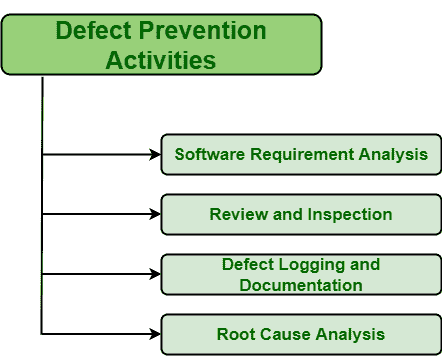

# 缺陷预防方法和技术

> 原文:[https://www . geesforgeks . org/缺陷预防方法和技术/](https://www.geeksforgeeks.org/defect-prevention-methods-and-techniques/)

**[【缺陷预防】](https://www.geeksforgeeks.org/defect-prevention-in-software-engineering/)** 基本上是定义为确保到目前为止被检测到的缺陷不会出现或再次发生的措施。用于促进团队成员之间的简单交流，计划和设计缺陷预防指南等。，协调员主要负责。

协调员主要负责领导缺陷预防工作，促进会议，促进团队成员和管理层之间的沟通等。动力定位板通常有季度计划，其中设定了组织层面的一些目标。为了实现这些目标，通常使用和执行各种方法或活动来实现和完成这些目标。

**预防缺陷的方法:**
对于预防缺陷，有不同的方法，通常使用很长一段时间。这些方法或活动如下:

1.  **Software Requirement Analysis :**
    The main cause of defects in software products is due to error in software requirements and designs. Software requirements and design both are important, and should be analyzed in an efficient way with more focus. Software requirement is basically considered an integral part of [Software Development Life Cycle (SDLC)](https://www.geeksforgeeks.org/software-development-life-cycle-sdlc/). These are the requirements that basically describes features and functionalities of target product and also conveys expectations or requirement of users from software product.

    因此，非常需要更仔细地了解软件需求，如果测试人员和开发人员没有很好地理解需求，那么在进一步的过程中可能会出现问题或缺陷。因此，以更合适和恰当的方式分析和评估需求是至关重要的。

2.  **评审和检查:**
    评审和检查，两者都是软件开发必不可少的组成部分。它们被认为是强有力的工具，可用于在缺陷出现并影响生产之前识别和消除缺陷。评审和检查在缺陷预防的不同层次或阶段出现，以满足不同的需求。它们用于所有软件开发和维护方法。有两种类型的审查，即自我审查和同行审查。
3.  **缺陷记录和文件:**
    在成功的分析和审查之后，应该保持关于缺陷的记录，以简单地完成缺陷的描述。该记录可进一步用于更好地了解缺陷。在获得缺陷的知识和理解之后，只有一个人可以采取一些有效的和必需的措施和行动来解决特定的缺陷，这样缺陷就不能被带到下一个阶段。
4.  **根本原因分析:**
    根本原因分析基本上是缺陷的主要原因分析。它只是分析是什么触发了缺陷的发生。在分析了缺陷的主要原因后，人们可以找到最佳的方法来避免下次出现这种类型的缺陷。