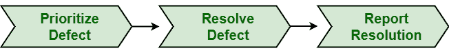

# 缺陷解决流程

> 原文:[https://www.geeksforgeeks.org/defect-resolution-process/](https://www.geeksforgeeks.org/defect-resolution-process/)

**缺陷解决**是软件改进中最重要的动作之一。哪些缺陷需要修复[优先](https://www.geeksforgeeks.org/defect-priority/)有时会变得非常困难。高度严重的缺陷有点难修复，需要开发团队大量的时间，而不太严重的缺陷很容易修复，需要开发团队更少的时间。一旦开发人员成功地确认缺陷有效，缺陷解决过程就开始了。

开发人员总是面临着解决缺陷和减少其影响的压力。如果指导方针没有明确，开发人员倾向于首先修复容易的缺陷。缺陷解决不是一个容易的过程，只要我们接触到一段代码来解决它，它也会影响其他领域。这将导致额外缺陷的出现。

**缺陷解决过程涉及的步骤:**
这个过程基本上有三个步骤:

1.  **优先考虑缺陷:**
    开发团队首先分析缺陷及其影响。然后，他们根据缺陷的严重程度对缺陷进行优先排序。这一步的主要目的只是回答一些问题，并立即采取必要的行动:
    *   缺陷以前是否报告过？
    *   缺陷应该被赋予什么优先级来修复它？
    *   在修复之前，应该采取什么步骤来减少缺陷的影响？
2.  **Resolve Defect :**
    On the basis of priority assigned to each defect, development team then resolves defects. Some defects need to fix immediately, some defects can be resolved later, and some defects are not needed to fix at all depending upon their impact and resources required to fix it. Some organizations simply treat lower priority defects as changes. All defects are equally created from perspective of how quickly they are needed to be fixed.

    解决缺陷还包括纠正和验证一个或多个可交付成果，即从系统中完全消除缺陷所需的程序、文档。当开发团队解决缺陷时，测试经理识别解决缺陷的过程。

3.  **报告解决方案:**
    然后开发人员必须进一步向测试团队报告解决方案，即缺陷何时以及如何被修复。简单地说，开发人员通知所有相关方缺陷何时以及如何被解决。一旦缺陷被解决，修复被验证，需要特定的开发人员、用户和测试人员通知缺陷已经被解决，包括其他信息，如:
    *   修复的性质
    *   修复何时发布
    *   它将如何发布