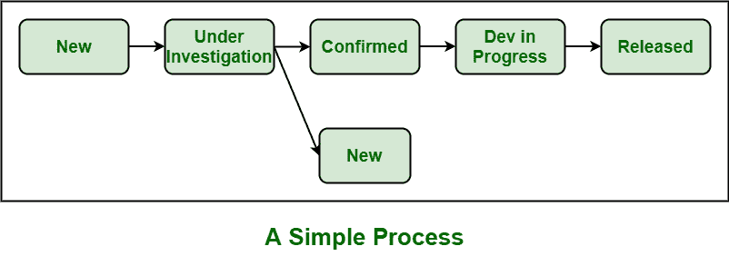

# 缺陷分类-一个简单的过程

> 原文:[https://www . geeksforgeeks . org/缺陷-分类-简单流程/](https://www.geeksforgeeks.org/defect-triage-a-simple-process/)

**[缺陷分类](https://www.geeksforgeeks.org/defect-triage-meeting/)** 是一个简单的过程，它帮助开发团队简单地根据缺陷的[严重性](https://www.geeksforgeeks.org/defect-severity/)和[优先级](https://www.geeksforgeeks.org/defect-priority/?ref=rp)来解决和修复缺陷。这是一个根据缺陷的严重性、导致的风险和发生的频率来确定缺陷优先级的过程。

1.  **New :**
    每当第一次识别到缺陷时，这个新的缺陷就会被添加到缺陷跟踪系统中。
2.  **正在调查中:**
    团队领导然后确定或评估缺陷报告是否正确。评估缺陷报告时，应考虑以下准则:

*   缺陷报告格式是否正确？
*   这个特殊的缺陷之前有没有被报告过？
*   谁发现了缺陷？
*   缺陷的原因是什么，或者问题有多严重？

**(一)。严重:-**
严重问题是指由于缺陷，系统的主要功能已经停止工作。
**(二)。在中间–**
属于此类别的缺陷可以在缺陷分类会议上讨论。
**(三)。低:**
属于这一类的缺陷不太严重，只对内部用户可见。

*   **被拒绝:**
    如果缺陷报告是重复的，或者分诊团队不能复制问题，或者没有保持正确的缺陷报告格式，那么特定的缺陷分诊报告被拒绝。*   **确认:**
    如果所有事情都是正确的，那么缺陷报告被确认，并进一步等待解决问题或缺陷。*   **进行中的开发:**
    在这种情况下，缺陷处于冲刺阶段，即缺陷正在处理中，特别是为了解决和修复缺陷。简单地说，缺陷正在解决中。*   **Released :**
    Finally, defect is completely resolved and fixed.

    **缺陷分类规则:**
    缺陷分类有以下几种规则:

    *   需要审查正在报告的缺陷。
    *   被接受的缺陷需要被优先考虑，并且还应该附加严重性。
    *   被拒绝的缺陷应该有合理的描述，即测试团队合理或可信的描述。
    *   每一个缺陷都需要分配给适当的团队或个人。
    *   应该对每个被接受的缺陷的主要或根本原因进行分析。

    **缺陷分类过程中出现的一些挑战:**

    *   有时，标准缺陷跟踪系统不可用。
    *   优先级和严重性没有适当地分配给特定的缺陷。
    *   测试团队、开发团队、业务涉众和产品所有者之间没有适当的沟通。
    *   缺陷分类会议期间没有适当的沟通。