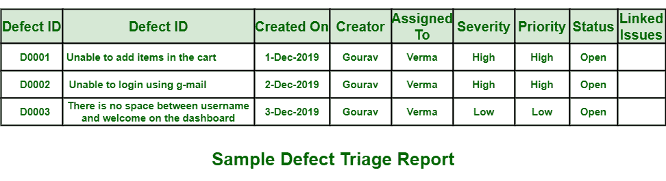

# 缺陷分类报告格式

> 原文:[https://www.geeksforgeeks.org/defect-triage-report-format/](https://www.geeksforgeeks.org/defect-triage-report-format/)

**[缺陷分诊会](https://www.geeksforgeeks.org/defect-triage-meeting/)一般称为**解决和修复缺陷。不同的参与者，即测试负责人、项目经理、技术负责人和开发团队负责人是会议的重要参与者。没有他们，就无法做出决定，会议也无法完成。在三个不同的阶段，即会前、会中和会后，缺陷分类会议完成。

会议结束后，会生成一份分类报告，其中包含会议期间发生的每件事的完整描述和详细信息。该分类报告包含从缺陷识别到缺陷根本原因的所有信息。该报告与所有与会者共享。示例报告格式如下所示:

**缺陷分类报告中的各个字段:**

1.  **缺陷 ID :**
    缺陷 ID 是一种身份证明文件，一般用于验证或识别缺陷。缺陷标识基本上是一个唯一的标识号，它被赋予每个缺陷以区分它们。
2.  **缺陷描述:**
    缺陷描述一般包括缺陷的详细描述。它还包括关于识别出缺陷的模块的信息。它还包括缺陷原因及其如何影响系统的工作。
3.  **创建日期:**
    创建日期是识别、发现或提出缺陷的日期。在创建日期，第一次报告了缺陷。
4.  **创建者:**
    创建者是提出或识别缺陷的测试者。创建者可能包括报告缺陷的测试人员的姓名或身份。
5.  **严重性:**
    严重性基本上解释了缺陷对系统或应用的影响。它包括缺陷如何影响系统。它只是衡量严重程度，即缺陷有多严重。
6.  **优先级:**
    优先级基本上与解决或修复缺陷有关。优先级代码只是指示特定缺陷对系统的影响。优先级代码可以是高、中或低。
    *   **高–**
        如果优先级代码高，意味着需要立即解决或修复缺陷。不解决这个特殊的缺陷，项目就不能成功。
    *   **中等–**
        如果优先级代码为中等，则意味着不需要立即解决或修复特定缺陷。它可以稍后解决，因为它不需要任何立即的行动。缺陷对系统的影响较小。

    *   **低–**
        如果优先级代码低，则表示不需要解决或修复缺陷。可能会解决，也可能不会解决。缺陷对系统的影响非常小，可以忽略不计。
7.  **状态:**
    这表示缺陷的当前状态，即缺陷是新的、正在进行的还是已完成的。
8.  **分配日期:**
    分配日期是缺陷被进一步修复或解决的日期。在这一天，缺陷被分配给特定的团队或个人进行解决。
9.  **分配给/开发人员:**
    开发人员是修复或解决缺陷的测试人员。开发人员可能包括已修复缺陷的测试人员的姓名或身份。
10.  **解决方案:**
    解决方案通常包括如何解决缺陷的详细描述。它包括所有解决缺陷的方法。
11.  **解决日期:**
    解决日期是解决缺陷的日期，即缺陷将由开发人员完全解决或修复的日期。
12.  **预计时间:**
    预计时间基本上是以完成解决方案所需的工作小时数表示的值，即修复或解决缺陷所需的预计时间。
13.  **实际时间:**
    实际时间基本上是以开发人员完成解决所花费的工作小时数来表示的值，即修复或解决缺陷所花费的实际时间。
14.  **根本原因描述:**
    该字段说明缺陷产生的主要原因。它解释了为什么缺陷会出现和出现。