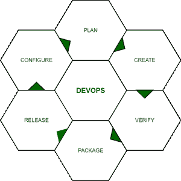
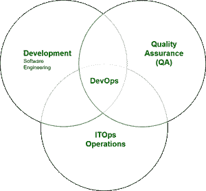
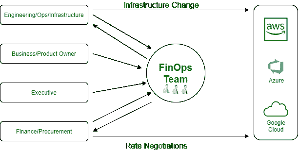
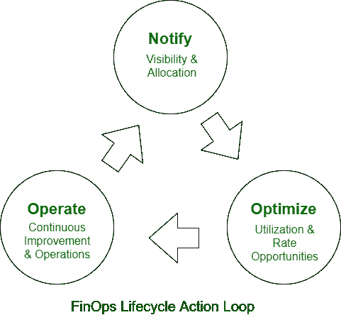

# 定义开发平台、NoOps 和 FinOps

> 原文:[https://www . geesforgeks . org/define-devo PS-noops-and-finops/](https://www.geeksforgeeks.org/define-devops-noops-and-finops/)

**先决条件:**[**DevOps**](https://www.geeksforgeeks.org/tag/devops/)**[**NoOPs**](https://www.geeksforgeeks.org/overview-of-noops/)**

****简介:**
在这篇文章中，我们将看看 DevOps、NoOps、FinOps 以及其他帮助企业更加灵活和安全的相关想法。理解这些想法对于为你的商品和消费者以最好的方式组织你的业务至关重要。**

**企业正在转向云转型和其他技术，而不是招聘更多人员。DevOps、NoOps，以及最近的 FinOps 都是你毫无疑问听到过的词汇。我们将在这篇文章中讨论所有这些单词之间的主要区别。**

****1。DevOps :**
近年来，DevOps 的领域已经成为游戏规则的改变者。每家公司，无论大小，现在都在拥抱 DevOps 文化。这有助于自动化流程和简化职责，从而实现更快、更高效的软件交付。DevOps 是第一个商业创新。DevOps 这个术语是通过开发和运营相结合而产生的。**

**软件开发和信息技术运营在 DevOps 中结合在一起。这套流程填补了 ITOP 留下的空白。它是促进开发和运营团队协作的最佳“工具”。很多人觉得这是一种心态或态度，而不是一套流程。**

****devo PS 的工作结构–****

****

**DevOps 团队的组织对于有效利用 DevOps 的优势至关重要。因此，企业必须确保团队由适当的个人组成，并且 DevOps 的角色和职责得到明确定义。**

**DevOps 与个人团队合作，管理公司内外的开发和运营数据。这有助于开发和运营部门更有效地合作。它使用各种技术工具来自动化这些活动。DevOps 使用现代技术和动态基础设施提供您想要的信息。**

****devo PS 代表什么？**
DevOps 的基本目标是确保快速高效地交付高质量的软件。换句话说，DevOps 协助开发新软件，满足消费者对创新的渴望，同时确保系统的稳定性和完整性。DevOps 缩短了可持续发展模式的周期。**

**这个想法是为了加速应用和程序的开发，同时为了客户的利益改进产品。DevOps 还参与业务分析、编码、软件测试、编码和定制软件。ITOps 和 DevOps 必须共同努力，尽快提供最好的产品。**

****devo PS 的工作–****

****

**DevOps 软件开发生命周期中包含了广泛的过程。每一级 DevOps 都有自己的一套工具来帮助你。
每个企业都必须依赖 DevOps 服务中包含的条款来实现预期的结果和增长–**

*   ****定义和规划–**
    专注于为迭代、错误跟踪和发布管理创建一个可行的 DevOps 工作流。这一领域的主要技术或设备提供商是 IBM、JAMA Software Atlassian、CA Technologies 和 iRise。**
*   ****协作–**
    协作在任何业务中都是必不可少的。不同部门的团队相互协作，而不是相互竞争。由于高效的沟通，他们在规定的时间内完成了指定的工作。**
*   ****构建、编码和配置–**
    现在是您的开发团队专注于代码开发和实现、源代码维护和代码组合的时候了。Bitbucket、IBM、GitLab、电云和 GitHub 都是达到这一水平的著名技术和供应商的例子。**
*   ****自动化–**
    为了让事情为公司服务，团队使用各种技术和小工具来自动化活动。对于每个部门，团队使用不同的工具。**
*   ****测试–**
    在开发过程中，您必须确保软件发布和代码质量得到维护。只有最好的代码才应该在生产中发布。著名的制造商和供应商包括德尔福、福斯克、惠普、IBM、天塔、微软、Parasoft、SonarSource 和 ThoughtWorks。**
*   ****包装和预生产–**
    是指一旦准备发布就必须完成的任务。在某些情况下，这个时间段称为分段。著名的技术和供应商包括 IBM、Inedo 的 ProGet、Jfrog 的 Artifactory 和 Sonatype 的 Nexus 存储库。**
*   ****持续管理和配置–**
    这一级包括代码基础设施自动化和管理的各种要素。一些主要的制造商和供应商包括 Ansible、Chef、IBM、Puppet Labs、Otter 和 Salt。**
*   ****连续部署–**
    代码会自动部署到正确的服务器，使用正确的参数，并在正确的环境中。**
*   ****持续监控–**
    不断检查部署的代码是否有缺陷或崩溃，以及用户输入。在接下来的生命周期开发阶段，这些见解被用来改进应用程序。**

****devo PS 的优势–**
devo PS 的优势可以总结为五点–**

*   **客户可以快速收到软件和应用程序。**
*   **确保更快地交付消费者要求的新功能。**
*   **改进了全栈开发人员和运营团队之间的协作。**
*   **它能更有效地找到问题的解决方案。**
*   **信息技术部门可以花更多的时间进行创新，而不是修补或维护不可靠的系统。**

****2。**
NoOps 是“无操作”的简称。NoOps 是一个越来越流行的短语，最近被许多 it 行业采用。它指的是一个不需要任何专门设备或团队的领域。管理一个企业，不需要任何操作。采用 NoOps 的公司无需专业团队即可自动运营。
NoOps，或无操作，指的是从软件开发到部署的一切自动化。根据 NoOps 的说法，如此高水平的自动化不需要专门的内部软件管理人员。**

****NoOPs 的目标–**
NoOPs 的基本前提是开发人员(或者更广泛地说，DevOps 从业者)不再负责运营，而是可以专注于软件开发。
NoOps 中的所有活动都是自动化的，这降低甚至消除了人为错误的风险，自动化流程更快，更不容易出错。由于所有可以自动化的事情都已经实现了自动化，因此在这种策略下，ITOps 人员不需要每天从事与技术相关的工作。**

****NoOps 的优势–****

*   **因为他们不再需要加入运营团队，NoOps 允许开发人员更有效地利用他们的工作时间。**
*   **人力资源不参与大多数流程，因此不太可能出现人为错误。**
*   **NoOps 帮助公司实现创收目标。开发时间越快，交付时间越快。最后，快速交货意味着他们会更快收到到期的现金。**
*   **因此，开发和运营团队都更有效率。因为他们可以专注于开发和运营，所以两个团队都可以做他们最擅长的事情。结果，生产率提高了。**
*   **大大降低或消除了人为失误的可能性；**
*   **DevOps 大大加快了日常运营和沟通。**

****3。FinOps :**
FinOps 是管理企业运营的最先进方式。财务运营是每个企业或组织的重要组成部分。在今天的行业中，这个术语已经被赋予了基于云计算技术的云平台。**

****

**FinOps 通过将包括技术、业务和财务专家在内的整个公司团队聚集在一起，提高了云服务的业务价值。更低的成本、更好的成本控制、更好地利用云资源以及有用的商业智能都是成功部署 FinOps 的结果。**

**在其他名称中，FinOps 代表“云财务运营”、“云财务管理”和“云成本管理”它是将财务责任与云的可变费用模型联系起来的过程，允许远程团队基于速度、成本和质量做出决策。**

****金融情报机构的生命周期–****

****

**FinOps 与公司内部的不同组织或团队合作，以实现预期的结果。FinOps 通过集成和组合各种技术和业务模式来提高云的总业务价值。
FinOps 分为三个不同的阶段:通知、优化和操作–**

*   ****Notify:**
    FinOps 的初始阶段是为公司和团队提供可见性、分配、基准、预算和预测。由于云技术是随需应变的，因此不可预测，因此需要准确及时的决策。企业和金融合作伙伴也希望通过控制预算和准确估算成本来提高投资回报率。例如，Apptio 声称能够看到今天的行动将如何影响未来，预测云财务，并监控云系统，以了解 IT 支出和成本如何符合业务目标。对齐与否。**
*   ****优化–**
    随着企业和团队意识的增强，他们现在必须优化他们的云足迹。虽然按需云功能通常是最昂贵的，但云公司通常提供几种定制选项。它们为某些情况提供折扣，这可能需要复杂的计算来实现预订和促进承诺。企业可以通过降低产能和减少浪费来利用这些可能性。**
*   ****运营–**
    企业现在必须定期评估绩效指标，看它们是否达到了目标。他们衡量其云能力的速度、质量和成本，并确保符合特定的云治理和法规。**

****财务绩效的重要性–****

*   ****云的成本变得很高–**
    随着云计算的普及，企业可以扩大在这项技术上的投资。尽管云系统为组织提供了可扩展的服务，帮助他们最大限度地利用资源，但他们往往不知道自己浪费了多少钱。根据 Gartner 的数据，到 2022 年，软件和云服务领域不断增长的投资中，约有 30%在任何一个月都将得不到充分利用。因此，通过优化云支出，企业可以显著降低总体成本。**
*   ****必须实时监控云可用性–**
    企业越来越依赖云服务来管理其数据库。但是，如果云基础架构出现故障，组织可能会遭受重大损失。他们可能在这种时候无法工作，导致潜在客户的流失。这种减少可能是由于云容量不足、资源分配效率低下或技术硬件问题。FinOps 解决方案可以帮助企业正确分配预算，并确保始终有足够的云容量。**