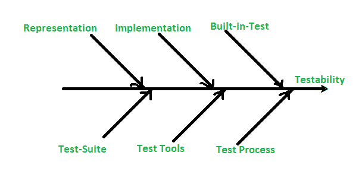

# 软件测试中的可测试性设计

> 原文:[https://www . geeksforgeeks . org/可测试性设计-软件测试中的 DFT/](https://www.geeksforgeeks.org/design-for-testability-dft-in-software-testing/)

**测试性设计(DFT)** 是一个程序，用于在资源有限或可靠性驱动的方案下，设定开发过程的最大有效性。一个资源有限的过程使用一种测试方法来获得已经达到发布前可靠性目标的结果。这个过程将测试视为在时间或金钱允许的情况下从系统中删除尽可能多的粗糙边缘的一种方式。在可靠性驱动的过程中，测试性对于降低成本都是非常重要的。并且还增加了资源有限的过程中的可靠性。

软件可测试性是许多因素的结果，其中一些因素如下:

1.  表象的特征。
2.  实施的特点。
3.  内置测试功能。
4.  测试套件。
5.  测试支持环境。
6.  进行测试的软件过程。

现在，让我们看看考虑可测试性关系的鱼骨图。

**1。表示:**
测试开发中表示的存在和有用性是一个关键的可测试性因素，原因如下:

*   **a.** 如果你在没有表示的情况下进行测试，就像在试验一个原型。
*   **b.** 如果没有任何预期结果的明确声明，表示不能决定测试是否通过。
*   **c.** 它也可以强制生成部分表示作为测试计划的一部分。

在表示中，有各种方法来开发面向对象的表示，如面向对象分析(OOA)或面向对象设计(OOD)。

**2。实现:**
一个符合被普遍接受的 OOP 原则的面向对象程序对测试造成的障碍最少。结构可测试性可以通过一些简单的度量来评估。度量可以指示可测试性、测试范围或两者。例如，由于类之间的高度耦合，通常更难控制被测类(CUT)，从而降低可测试性。所有内在测试性度量的效果都是一样的:

*   **a.** 相对较高的值=可测性降低。
*   **b.** 相对低值=增加的可测试性。

范围度量表示测试的数量与度量的值成正比。

**3。内置测试:**
它提供了测试和应用程序功能的明确分离。内置测试具有以下一些特性:

*   **a.** 内置 n-test 中的断言自动执行基本检查，并为程序的正确执行提供基本条件的“设置并忘记”运行时检查。
*   **b.** 设置或重置有助于可控性。
*   记者有助于观察。
*   **d.** 测试套件是测试用例和使用它们的计划的集合，它定义了测试计划的一般内容。
*   **e.** 测试工具需要自动化，没有自动化，测试会更少，实现给定的可靠性目标会产生更多的成本。