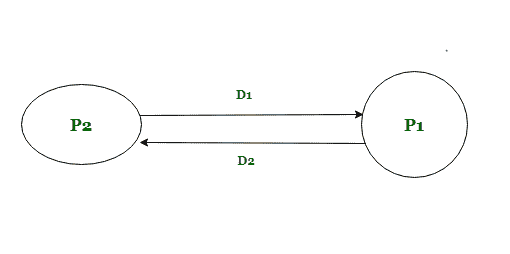
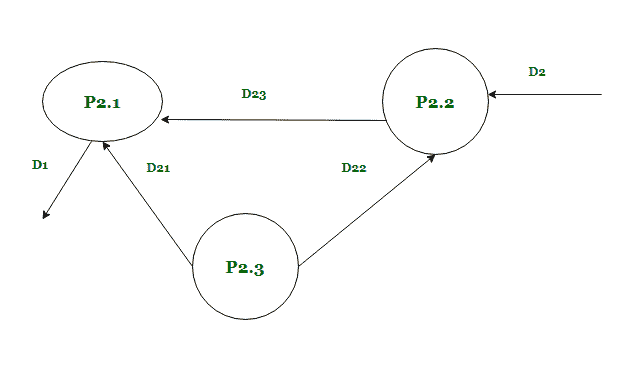
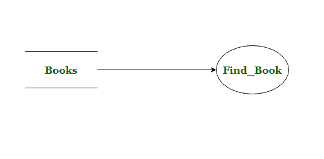
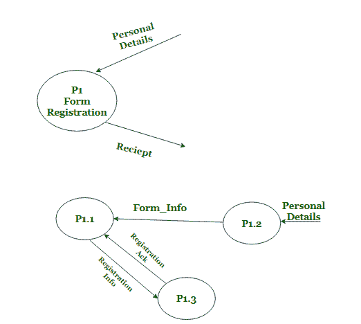
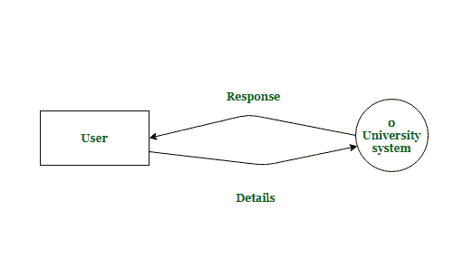
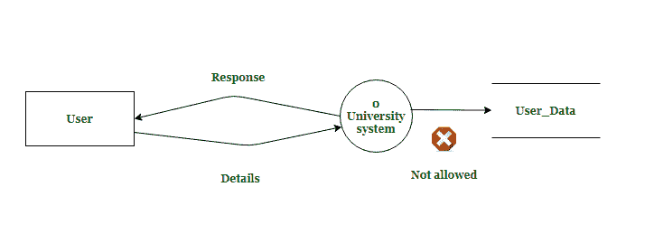
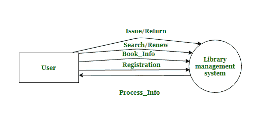

# 开发系统的 DFD 模型

> 原文:[https://www . geesforgeks . org/developing-DFD-系统模型/](https://www.geeksforgeeks.org/developing-dfd-model-of-system/)

[系统的数据流图(DFD)](https://www.geeksforgeeks.org/what-is-dfddata-flow-diagram/) 以图形方式表示输入数据如何转换为输出数据。级别 0 也称为上下文级别，代表系统最基本和抽象的视图。随后，可以从中分解出其他较低的级别。一个系统的 DFD 模型包含多个离散傅立叶变换，但整个 DFD 模型只有一个数据字典。数据字典包括在 DFD 使用的数据项的定义。

**上下文图:**
它演示了单个进程/气泡中系统的整个数据流。泡泡用代表整个系统的“名词”标注。这只是在使用名词(以系统名称的形式)的 DFD 出现的泡沫。之所以命名它，是因为上下文图的目的是获取系统的上下文，而不是功能。所有其他气泡都有一个动词，根据它所执行的主要功能。

上下文图显示了三件主要的事情:用户、流向系统和来自系统的数据流。它捕获与系统交互的各种外部实体，作为输入和输出箭头的进出系统的数据。背景图要求分析安全气囊系统文件。数据流用箭头顶部的数据名称表示。

**1 级和其他下级图的构建:**
1 级 DFD 包含 3 到 7 个代表功能的气泡。有些过程可以分解为子过程，每个子过程代表一个气泡。每个泡泡都有一个**动词**，展示这个过程的功能。为了创建 1 级/2 级或其他级别的 DFD，一个气泡被分成包含 3-7 个功能的子部分。如果有超过 7 个子过程，那么一些相关信息可以组合在一起。如果少于 3 个子过程，可以进一步分解产生更多的气泡。

**分解:**
气泡在 DFD 层次的连续层次上分解为子函数。分解被称为分解/分解泡沫。任何级别的每个气泡都可以分解成 3 到 7 个气泡。但是，一旦发现气泡代表一组简单的指令，就不应该进一步分解它。任何层面的泡沫太多，都让 dfd 难以理解。非常少的气泡使分解变得多余和琐碎。

**编号:**
每个工艺符号必须使用唯一的参考编号来区分。当分解一个泡泡 x 时，它的子代被编号为 x.1、x.2 等等。它可以帮助确定它的祖先、继承者，并精确地确定它的水平。例如，0 级 DFD 编号为 0。级别 1 被编号为 0.1、0.2、0.3 或 1、2、3 等等。级别 2 标记为 1.1、1.2、1.3 等。

**平衡 DFD :**
具有流入和流出数据流的父 DFD 应该匹配下一个子级的数据流。这就是所谓的平衡 DFD。概念如图所示:

一级 DFD

二级 DFD 分解 P2

在 1 级 DFD，数据项 D1 流出泡泡 2，数据项 D2 流入泡泡 2。在下一级，气泡 2 被分解成三个子过程(2.1，2.2，2.3)。它有数据项 D1 流出和 D2 流入。所以 DFD 在这里是平衡的。

代表一个过程的气泡应该至少有一个输入流和一个输出流。当一个气泡有输入流而没有任何输出流时，称为“黑洞”。当一个过程有输出流但没有输入流时，这被称为“奇迹”。一个处理步骤的输出可能大于其输入之和，这种情况称为灰孔。

**构造 DFD 时要避免的常见错误:**

*   DFD 应该总是代表数据流，不应该有控制流。
*   所有外部实体都应该在上下文级别表示。
*   必须在 dfd 中捕获系统的所有功能，任何功能都不应被忽略。此外，应该只表示 SRS 中指定的那些功能。
*   连接到数据存储的箭头不需要用任何数据名称进行注释。

数据存储箭头没有注释

*   发展筹资应始终在各级保持平衡。进出父进程的数据流必须出现在子图中。

不平衡的 DFD(子代中没有收据生成)

*   上下文级气泡总是以名词的形式包含整个系统的名称，并且在其表示中不能使用动词。而所有其他级别在气泡表示中都只有动词。

以名词作为系统名称的上下文级别

*   级别 0 中不应有任何数据库。级别 0 仅包含一个气泡和外部实体。

数据存储的 0 级不正确

*   在 DFD 不应该描绘杂乱无章。当进出 DFD 的数据也可能流动时，将这些数据项组合成高层项目。

DFD 语带杂乱

*   DFD 中具有唯一进程的所有气泡都应该连接到另一个进程或数据存储。它不能独立存在，与系统的其余部分无关。