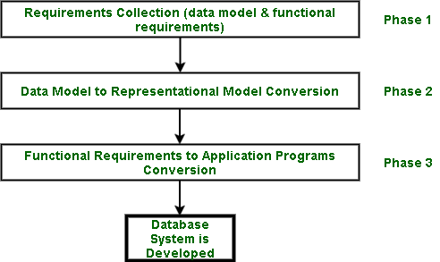

# 数据库系统的开发阶段

> 原文:[https://www . geesforgeks . org/development-phases-of-database-system/](https://www.geeksforgeeks.org/development-phases-of-database-system/)

数据库系统分以下几个阶段开发:

*   **阶段-1:需求收集阶段–**
    这个阶段的目标是从涉众和用户那里收集正确的需求。只有当用户清楚地了解自己的需求时，这才是可能的。如果用户不清楚自己的需求，整个过程就会偏离轨道。整个系统建立在这一阶段的发现之上；因此，这是一个非常重要的阶段。在此阶段收集了以下两种需求:

1.  **Data model requirements :**
    These deal with different pieces of data that need to be stored along with their relationships with one another. The data model requirements are represented using conceptual level data models, like [entity/relationship model (ER model)](https://www.geeksforgeeks.org/introduction-of-er-model/) and [Unified Modelling Language (UML)](https://www.geeksforgeeks.org/unified-modeling-language-uml-introduction/).

    **注–**
    UML 在大规模软件开发过程中更受欢迎。

2.  **[功能需求](https://www.geeksforgeeks.org/functional-vs-non-functional-requirements/) :**
    这涉及到正在为其开发数据库的企业所承担的日常任务和操作。例如，医院系统的功能需求将是:获取新药、维护医生记录、维护患者记录、添加新的患者记录等。

*   **Phase-2: [Data Model](https://www.geeksforgeeks.org/data-models-in-dbms/) to Representational Model Conversion Phase –**
    In this phase, we need to convert the data model into a representational level model such as *Relational Data Model* and choose an RDBMS system (i.e., from the providers of the RDBMS system e.g. Oracle, DB2, MySQL) to create database.*   **阶段-3:应用程序的功能需求转换阶段–**
    在这个阶段，高级语言(HLL)，如 C、C++、Java 等。与 SQL 结合使用，与数据库通信并修改它们，以捕获企业的日常活动(正在为其开发数据库系统)。