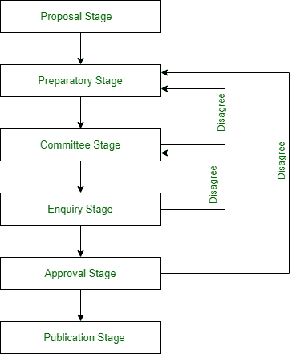

# 标准的发展阶段

> 原文:[https://www . geesforgeks . org/development-stages-of-standards/](https://www.geeksforgeeks.org/development-stages-of-standards/)

每个组织都需要一些标准来制造产品和服务，以便可以在不同的提供商之间使用和切换，从而为用户提供选择最佳的产品和服务，而不会面临任何供应商锁定类型的问题。但是这些标准并不容易制定。

标准是通过不同的发展阶段制定的。当一个组织开发可以公开使用的标准时，通常会发布关于过程的正式规则。虽然这可能是一个冗长乏味的过程，但是正式的标准制定对于开发新技术是必不可少的。

通过标准组织创建的标准可以提高产品质量，确保竞争对手产品的互操作性，并为未来的研究和产品开发提供技术基线。对消费者的一些好处包括，增加创新，多个市场参与者，降低生产成本，产品互换性。

让我们寻找开发标准所涉及的各个开发阶段。

*   **阶段 1:建议阶段–**
    这是评估新标准需求的初始阶段。这个技术委员会投票决定是否需要标准。一旦投票通过，项目负责人由技术委员会自己任命，他们将展望下一阶段。
*   **阶段 2:准备阶段–**
    当选的项目负责人现在开始准备标准草案。草稿经过多次修改，直到工作组满意为止。经工作组所有成员批准后，起草并提交给国际标准化组织中央秘书处。
*   **第三阶段:委员会阶段–**
    草案一旦完成，就由国际标准化组织中央秘书处注册。它由技术委员会/小组委员会进行审查和表决，以获得多数票。如果大多数人赞成，就达成协议。一旦达成协议，文本将作为国际标准草案提交。如果技术委员会投票反对支持标准，那么草稿将被拒绝并送回工作组进行进一步的迭代。
*   **第 4 阶段:询价阶段–**
    一旦投票赞成并制定了国际标准草案(DIS)，则在 5 个月内将其分发给所有 ISO 成员进行投票和评论。如果三分之二的多数支持草案，那么最终的国际标准草案(FDIS)就准备好了。如果草案未能达到三分之二的多数，它将被送回技术委员会进一步研究。
*   **阶段 5:批准阶段–**
    国际标准最终草案制定后，在 2 个月内分发给所有 ISO 成员进行最终验收。如果在此阶段收到任何技术意见，则在此阶段将不再考虑这些意见，但会进行登记，以供下一次修订时考虑。如果验收低于两个三分之一标准则退回技术委员会。
*   **第 6 阶段:出版阶段–**
    一旦国际标准的最终草案获得批准，将只考虑和更改最小的编辑更改。最终文本被发送到发布国际标准的国际标准化组织中央秘书处。

标准的发展阶段

在标准的开发过程中，采用标准有各种驱动因素。其中一些是:

*   **采用的驱动因素–**
    网络效应:在经济学中，术语网络效应是商品或服务的一个用户对该产品对其他人的价值的影响。当网络效应出现时，商品或服务的价值会随着用户数量的增加而增加。
*   **降低成本–**
    当今大多数组织面临的挑战之一是单一供应商产品的采购和维护成本。因为开放标准通过以名义价格提供规范来防止供应商锁定，所以更多的供应商站出来为提供有竞争力价格的项目投标。
*   **迫在眉睫的好处–**
    采用开放标准的令人信服的好处有很多。首先，离散系统之间的互操作性和防止供应商锁定吸引了企业和政府采用开放标准。