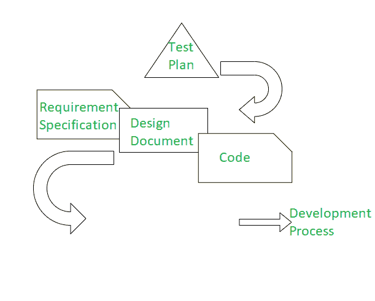

# 软件工程中的开发测试

> 原文:[https://www . geesforgeks . org/development-testing-in-software-engineering/](https://www.geeksforgeeks.org/development-testing-in-software-engineering/)

**先决条件–**[**软件测试类型**](https://www.geeksforgeeks.org/types-software-testing/)

**开发测试–**这是一种在整个软件开发生命周期过程中一致应用测试实践的方法。该测试确保在正确的时间检测到错误或错误，这进一步确保了在时间和成本方面延迟任何类型的风险。开发测试旨在建立一个框架来验证给定项目的要求是否符合要完成的任务的规则。该测试由软件开发人员或其他工程师在软件开发生命周期(SDLC)的构建阶段执行。开发测试是整个软件开发生命周期中产品开发的一个连续或运行过程。与可以多次进行的其他测试相比，该测试只进行一次。为了满足截止日期，开发测试在软件产品的开发阶段执行，

在开发测试中，各阶段被更紧密地集成在一起，以便被编写和签入的代码被自动测试。通过这种方式，可以更快地发现并解决问题。

**何时进行开发测试？**

*   当编写新代码或构建新软件产品时。
*   当开发成本较低时，客户端应该执行开发测试，这样客户端就不必面对调试和另一个测试成本。

开发测试需要一些指标，这取决于组织之间的关系，这些指标可能包括以下内容:

1.  **静态代码分析:**静态代码分析是在运行程序之前通过分析源代码进行调试的技术。它是通过对照一组或多组编码规则分析一组代码来实现的。这包括分析源代码，而不是实际执行程序。
    通过执行静态代码分析，开发人员将很早就知道他们的代码中是否有任何问题，这样就可以更容易地修复这些问题。

2.  [**【数据流分析】**](https://www.geeksforgeeks.org/data-flow-testing/) **:** 这个概念使用控制流图机制来检查程序的流，在不同的级别。数据流测试是一种结构测试。它是一种根据程序中变量的定义和使用位置来寻找程序测试路径的方法。与数据流图无关。该测试使用控制流图来检查代码中可能中断程序流的异常。

3.  [**公制分析**](https://www.geeksforgeeks.org/software-measurement-and-metrics/) **:** 公制是计量的代名词。为了计算程序的效率，在这种情况下使用了各种软件度量，如计算圈复杂度、计算代码行(LOC)、函数点等。在度量分析中，测试度量用于为下一阶段的活动做出决策，如成本估算&未来项目，识别项目成功所需的改进类型，或对要修改的过程或技术做出决策等。

4.  **代码审查:**检查源代码，并检查其中是否有任何缺陷。它可以用来发现和消除代码中的缺陷，如内存泄漏和缓冲区溢出。像同行评审一样在早期阶段进行代码评审是非常重要的，在您发送要测试的代码进行开发之前，先执行这一步。此外，对代码进行一些功能测试，以便在代码审查中变得容易。有多种方法可以进行代码评审，例如电子邮件线程、结对编程、越肩和工具辅助。

**开发测试的好处:**

*   有助于提高软件开发生命周期的效率
*   有助于减少软件错误
*   加快交付过程
*   当代码被持续测试时，它可以随时提供高质量的代码
*   在市场上部署新功能所需的时间更少

**开发测试的缺点:**

*   这种测试非常耗时，因为它是在软件产品的整个阶段完成的

**开发测试所需的工具:**

为了进行软件产品的测试，市场上有许多自动化测试工具，其中一些我已经在下面给出了。软件测试最常用的工具有:

*   硒
*   测试专家
*   HPE 统一功能测试
*   沃特沃特 Walter
*   加泰罗尼亚工作室