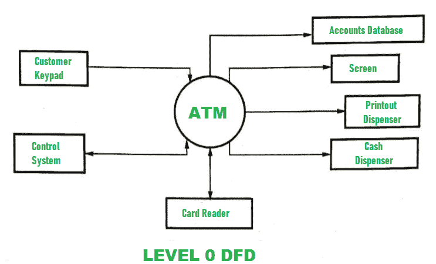
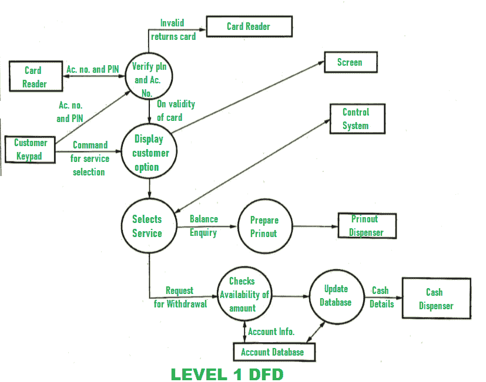

# DFD 为 ATM 系统

> 原文:[https://www.geeksforgeeks.org/dfd-for-atm-system/](https://www.geeksforgeeks.org/dfd-for-atm-system/)

自动柜员机系统的 DFD(数据流图)由两个级别的 DFD 组成。这些级别是 0 级 DFD 和 1 级 DFD。这两个级别都用来构成自动柜员机系统的 DFD。

1.  **Level 0 DFD :**
    This level is also known as Context Level DFD. At this level, only the interacting inputs and outputs with a system are described. The DFD of this level is shown below:

    

2.  **Level 1 DFD :**
    At this level, more detailed information is given about the processing of the ATM system. The DFD of this level is shown below:

    