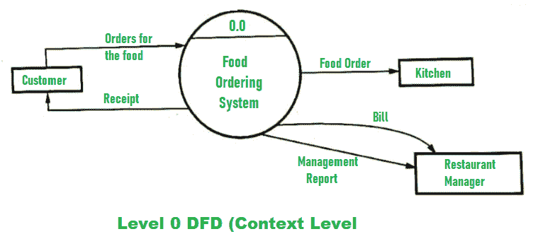
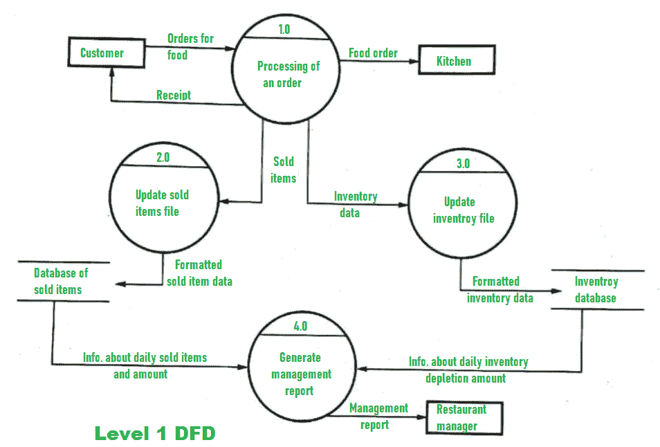
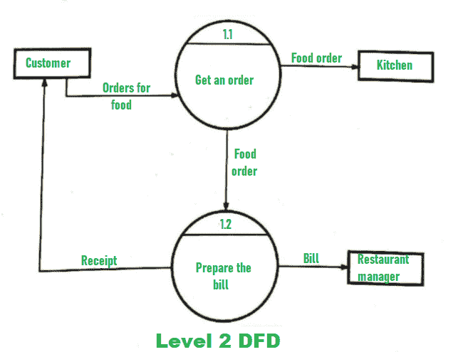
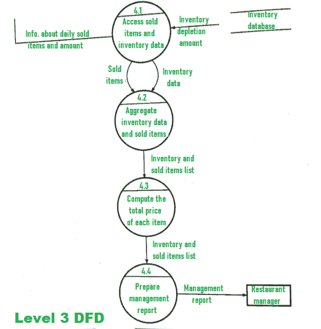

# DFD 订餐系统

> 原文:[https://www.geeksforgeeks.org/dfd-for-food-ordering-system/](https://www.geeksforgeeks.org/dfd-for-food-ordering-system/)

食品订购系统实际上是一种软件，允许餐馆经理管理和接受通过互联网或在餐馆下的订单。让我们通过使用 [DFD(数据流图)](https://www.geeksforgeeks.org/levels-in-data-flow-diagrams-dfd/)来了解一下订餐系统的工作原理。DFD 订餐系统如下所示。

这里，显示了食品订购系统的不同 DFD 级别，如 0 级 DFD、1 级 DFD、2 级 DFD 和 3 级 DFD。

1.  **Level 0 DFD –**
    At this level, the Input and Output of the system are shown. The system is designed and established across the world with input and output at this level.

    

    食物订购系统有以下输入:

    *   食品订单作为顾客的食品订单输入。

    食品订购系统具有以下输出:

    *   收到订单。
    *   为了进一步处理订单，食品订单被传递到厨房。
    *   餐厅经理得到了比尔和管理层的报告。
2.  **Level 1 DFD –**
    For processing the order, process 1.0 is responsible. For food, the housekeeping activities involved are represented by processes 2.0, 3.0, and 4.0\. The detailed information about daily sold items should be available to create and report management and the list of items that are available ‘in-stock’ should be kept by maintaining the inventory data (describes the records of datasets such as their name, their content, source, many useful information, etc.) at the same time.

    因此，在 DFD 的这个级别中使用了两个数据存储，如下所示:

    *   已售商品数据库
    *   库存数据库

    

    最后，利用每天售出物品的数量和每天的库存损耗，很容易准备一份管理报告。此外，餐厅经理会收到这份管理报告。

3.  **Level 2 DFD –**
    Detailed information about “Processing of an Order” is shown below :

    

4.  **Level 3 DFD –**
    More detailed information about the activity of the “Generate Management Report” is given at this level of DFD. Having access to data of sold items and data of inventory should be available for generating the report of management. Then, both data of solid items and data of inventory need to be aggregated after which the restaurant manager should get the report of management that is prepared from the above calculations.

    以上详情如下:

    