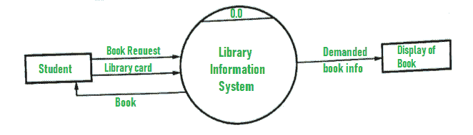
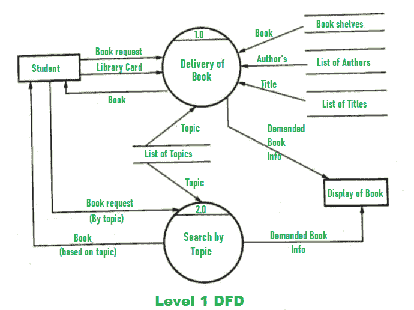
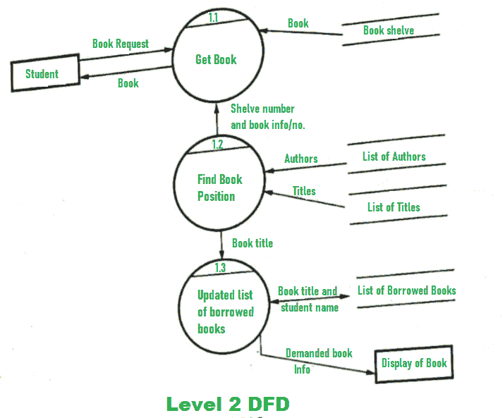

# DFD 图书馆管理系统

> 原文:[https://www . geesforgeks . org/DFD-for-library-management-system/](https://www.geeksforgeeks.org/dfd-for-library-management-system/)

[数据流图(DFD)](https://www.geeksforgeeks.org/levels-in-data-flow-diagrams-dfd/) 描述了当数据从系统移入和移出时的信息流和应用的转换。整个系统用 DFD 的输入、处理和输出来表示和描述。输入可以是:

*   **书本请求**当学生请求书本时。
*   **借书证**当学生必须出示或提交自己的身份作为证明时。

整个处理单元将包含系统将产生或生成的以下输出:

*   学生要求的书将会给他们，书就是输出。
*   学生在选择图书时，应通过图书馆信息系统显示所需图书的信息，以方便学生选择。

1.  **Level 0 DFD –**

    

2.  **1 级 DFD–**
    在这个级别，系统必须显示或暴露更多的处理细节。
    需要执行的重要流程有:

*   图书递送
*   按主题搜索

作者列表、标题列表、主题列表、可以找到书籍的书架是这些过程所需的一些信息。**数据存储**用于表示这类信息。

*   **Level 2 DFD –**

    

**超出范围:**
以上系统不考虑其他活动，如购买新书、更换旧书、收取罚款等。