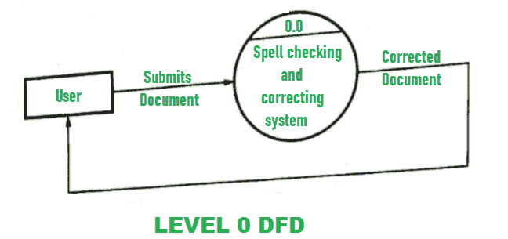
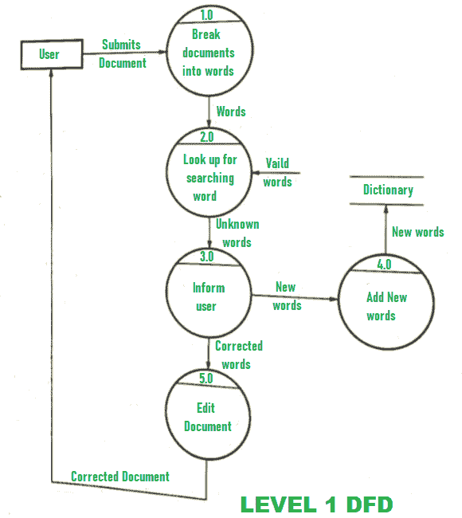

# 文字处理器拼写检查和纠正 DFD

> 原文:[https://www . geesforgeks . org/DFD-for-拼写检查和纠正-in-word-processor/](https://www.geeksforgeeks.org/dfd-for-spell-checking-and-correcting-in-word-processor/)

**文字处理**简单来说就是使用文字处理器创建或编辑文档的过程。文字处理器实际上是一种软件或设备，借助它可以编辑、创建或打印文档。现在，各种各样的文字处理器都有，像微软的 word、OpenOffice Writer、谷歌的 Docs 等等。它通常负责提供输入、编辑、格式化、文档输出或带有一些附加功能的文本。拼写检查是文字处理中的一个软件程序，它首先检查一个单词的拼写，识别拼写是否有错误，如果发现该单词拼写错误，则该拼写检查程序会在文字处理器中纠正拼写。

**DFD(数据流图)**用来描述文字处理器中的这个拼写检查和纠正功能。通常借助 DFD 的不同等级来解释，即 0 级 DFD 和 1 级 DFD。这些级别的工作如下所示:

*   **Level 0 DFD –**
    At this level, the submitted document from the user is checked and if found any error then it’s corrected. The corrected document is ended back to the user.

    

*   **Level 1 DFD –**
    At this level, the submitted document from the user is broken down or divided into different words and then identifies and checks the spelling. If the word found is new then it is also added to the dictionary. And if the word found is not correct then the word is corrected first and the document is edited. After this, the edited document is submitted back to the user.

    