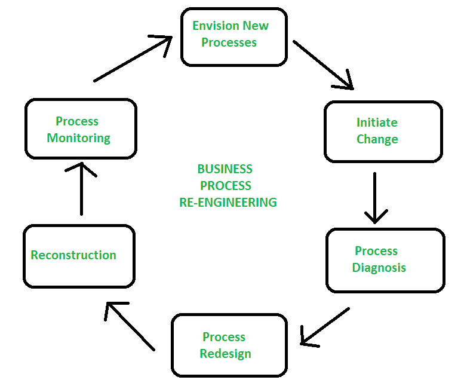
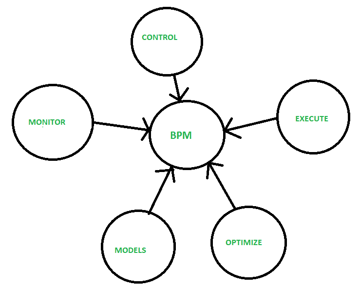

# 业务流程再造和业务流程管理的区别

> 原文:[https://www . geesforgeks . org/BPR 和-bpm 之间的差异/](https://www.geeksforgeeks.org/difference-between-bpr-and-bpm/)

**1。业务流程再造(BPR) :**
业务流程再造(BPR)发展于 20 世纪 90 年代初，是一种管理方法，旨在通过提高组织内部和组织之间流程的效率和有效性来进行改进。是 [ERP](https://www.geeksforgeeks.org/introduction-to-erp/) 八大技术之一。

它有自己的阶段，如开始组织变革、构建重新设计的组织、确定业务流程再造机会、理解现有流程、重新设计流程、规划新的业务系统和执行转型。

**优势:**

*   满意
*   知识的增长
*   对公司的声援
*   苛刻的工作
*   权威

**缺点:**

*   对变革的抵制
*   对工人的更高要求
*   在某些情况下，业务流程不是重新设计的，而仅仅是自动化的。
*   缺乏管理支持

**2。业务流程管理(BPM) :**
业务流程管理(BPM)实时更新流程。这是一种以流程为中心的方法，用于将信息技术与治理方法相结合来提高业务绩效。这是一系列有助于业务顺利运行的活动。这些过程从公司的活动开始，从开始阶段到最终销售。

BPM 涉及的关键流程有[风险管理](https://www.geeksforgeeks.org/software-engineering-risk-management/)、业务流程建模、业务流程外包、员工激励、产品库存。它的主要目标是提高公司业务的有效性和效率，并改善运营绩效。

**优势:**

*   指导用户做出决策。
*   自动确定工作的优先顺序和路线。
*   实时可见性和过程控制。
*   改进预测。
*   提高生产率。
*   成本更低。

**缺点:**

*   不允许重复过程。
*   它有它的极限。
*   缺乏沟通。

**业务流程再造与业务流程管理的区别:**

| 业务流程重组 | 每分钟的节拍数 |
| --- | --- |
| 代表业务流程再造。 | 代表业务流程管理。 |
| 实施是彻底的一步到位的改变。 | 实施是渐进和持续的。 |
| 实施时间很长。 | 实施时间短，接管顺利。 |
| 一次一个主要过程。 | 它是灵活的。 |
| 它是业务和流程专家。 | 它的参与有过程专家和所有相关人员。 |
| 风险很高。 | 风险很低。 |
| 结果有时会很激烈。 | 结果得到改善。 |
| 文化问题是人们主要关心的问题。 | 文化问题不太受关注。 |
| 实施压力和关注度很高。 | 实施压力和关注度较低。 |

