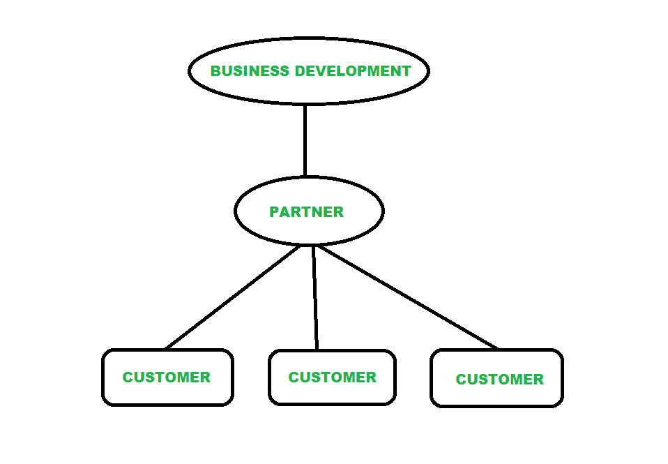
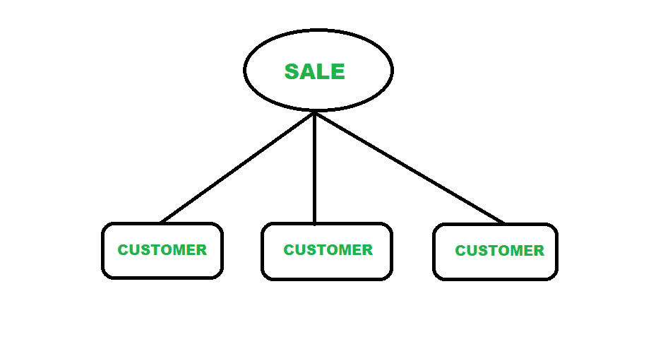

# 业务发展与销售的区别

> 原文:[https://www . geesforgeks . org/业务开发和销售之间的差异/](https://www.geeksforgeeks.org/difference-between-business-development-and-sales/)

**1。商业发展:**
商业发展是指通过在市场上创造竞争地位来拓展新市场的活动。这并不意味着在短时间内完成尽可能多的销售，相反，它还侧重于为进一步的业务发展建立关系。它总是以销售产品为目标，通过在市场上建立伙伴关系来销售产品，这有助于未来的业务。

下图**说明了业务发展**

**2。销售:**
销售是指通过向所选细分市场的客户销售产品来赚取收入，它总是以任何方式销售产品并获取利润为目标。它的重点是达成交易意味着成交，获得领先，走向终点线。它总是以向最终客户销售产品为目标，不考虑未来的业务，而是专注于眼前的结果。

下图**说明了销售**

**业务发展与销售的差异:**

| 没有。 | 业务发展 | 销售 |
| 01. | 业务发展是指旨在通过在市场中创造竞争地位来拓展新市场的活动。 | 销售是指通过向所选细分市场的客户销售产品来赚取收入。销售的目的是销售产品并获取利润。 |
| 02. | 这并不意味着在短时间内完成尽可能多的销售，相反，它还侧重于为进一步的业务发展建立关系。 | 它的重点是达成交易意味着成交，获得领先，走向终点线。 |
| 03. | 业务发展总是以销售产品为目标，通过在市场上建立伙伴关系来销售产品，这有助于未来的业务。 | 销售总是以向最终客户销售产品为目标，它不考虑更多的未来业务，而是专注于眼前的结果。 |
| 04. | 它的主要目的是通过成为公司的一部分来代表公司的基本战略组成部分。 | 它主要旨在与客户直接互动。 |
| 05. | 它是面向关系的，因为它主要侧重于建立双方之间的关系。 | 它是面向交易的，因为它主要集中在双方之间进行交易。 |
| 06. | 一般来说，企业中的业务开发团队比销售团队规模小。 | 一般来说，企业中的销售团队比业务开发团队规模更大。 |
| 07. | 它专注于销售产品。 | 它专注于战略合作伙伴。 |
| 08. | 业务开发团队旨在设计、聚焦和获取计划。 | 销售团队执行业务开发团队设计的计划。 |
| 09. | 业务发展是长期的。 | 销售是短期的。 |

