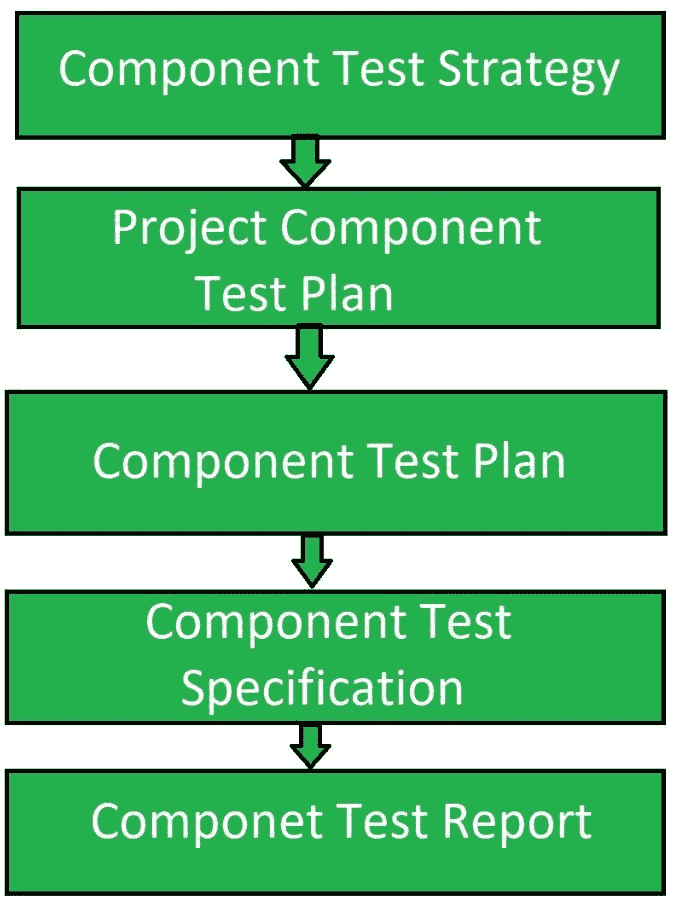
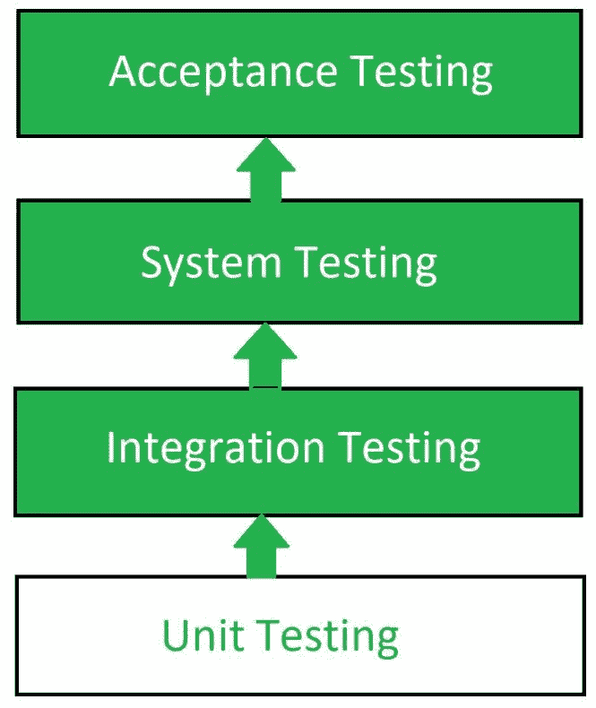

# 组件和单元测试的区别

> 原文:[https://www . geesforgeks . org/组件和单元测试之间的差异/](https://www.geeksforgeeks.org/difference-between-component-and-unit-testing/)

**组件测试:**
组件测试是一种类型的[软件测试](https://www.geeksforgeeks.org/software-testing-basics/)，其中测试每个单独组件的可用性。除了可用性测试，还会对每个组件进行行为评估。为了执行这种类型的测试，每个组件需要处于独立状态，并且也应该处于可控状态。软件的每个组件都应该是用户可理解的。

**[单元测试](https://www.geeksforgeeks.org/unit-testing-software-testing/) :**
单元测试是对软件的单个单元，即一组计算机程序模块、使用程序和操作程序进行测试，以确定它们是否适合使用的一种软件测试。这是一种测试方法，使用它来测试每个独立的模块，以确定开发人员自己是否有任何问题。它与独立模块的功能正确性相关。

**组件测试和单元测试的区别:**

| 组件测试 | 单元测试 |
| --- | --- |
| 组件测试包括分别测试软件的每个对象或部分。 | 单元测试包括对单个程序或程序执行模块的测试。 |
| 它由测试团队执行。 | 它由开发团队执行。 |
| 组件测试是黑盒测试。 | 单元测试是白盒测试。 |
| 测试人员不知道软件的内部架构。 | 测试人员知道软件的内部设计。 |
| 一旦执行了单元测试，就执行组件测试。 | 单元测试在组件测试之前进行。 |
| 与单元测试相比，缺陷检测并不困难。 | 在单元测试中，缺陷的检测很容易。 |
| 一旦整个软件被开发出来，那么只执行组件测试。 | 单元测试在每个开发步骤之后执行。 |
| 它验证测试需求。 | 它验证设计文档。 |

