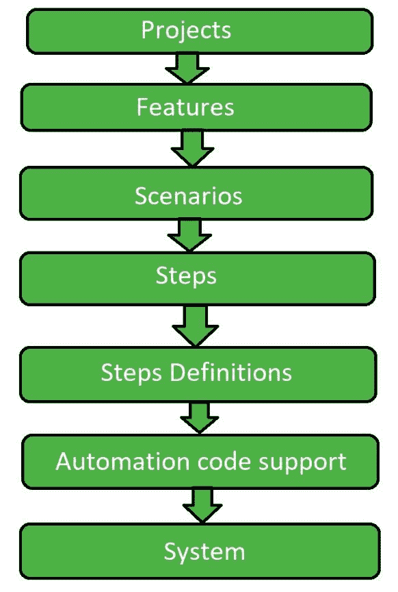

# 黄瓜检测和硒检测的区别

> 原文:[https://www . geesforgeks . org/黄瓜检测和硒检测的区别/](https://www.geeksforgeeks.org/difference-between-cucumber-testing-and-selenium-testing/)

**黄瓜测试:**
黄瓜测试是一个软件测试，使用支持行为驱动开发(BDD)的工具。它提供了一种编写测试的方法，任何人都可以理解，不管他们的技术知识如何。

**Selenium Testing:**
Selenium Testing 是一个软件测试，使用了一个支持 Functional and Performance(Selenium Grid)测试工具的工具。这与黄瓜测试非常相似，尽管有一些变化。

**黄瓜检测与硒检测的区别:**

| 黄瓜测试 | 硒测试 |
| --- | --- |
| 它使用行为驱动开发工具。 | 它使用功能和性能(硒网格)工具。 |
| 黄瓜插件工作更快。 | 插件比黄瓜慢。 |
| 黄瓜框架支持除 Ruby 之外的其他语言，如 Java、Scala、Groovy 等。 | Selenium 支持 Java，。Net 和许多其他语言。 |
| 编写自动化步骤是测试人员和开发人员的共同努力。 | 像黄瓜工具一样，编写自动化步骤是测试人员和开发人员的共同努力。 |
| 黄瓜只支持网络环境。 | 仅支持 web 环境。 |
| 它是免费的。 | 也是免费的。 |

