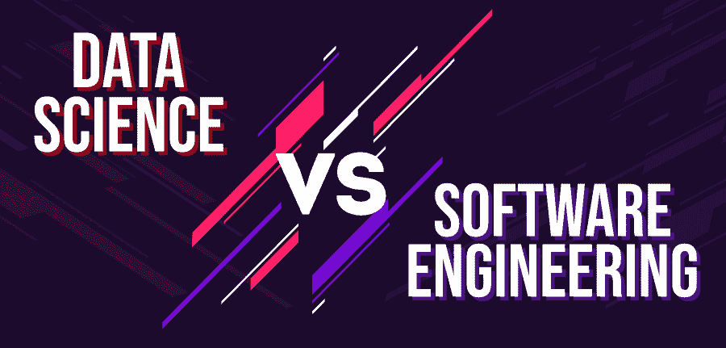

# 数据科学与软件工程的区别

> 原文:[https://www . geesforgeks . org/数据科学与软件工程的区别/](https://www.geeksforgeeks.org/difference-between-data-science-and-software-engineering/)

**数据科学:**数据科学可能是一个融合了处理海量信息、创建算法、机器学习等内容的空间，以提出商业见解。它包含了对大量数据的处理。包括不同的处理来从源推断信息，如提取数据、清理数据，然后将其转换为客户端吸引安排，这可以鼓励被利用的数据执行任务。
数据科学包括利用机器人化的策略来分析大量信息并从中提取信息。

**软件工程:**软件工程的特点是准备分析客户需求，然后规划、构建和测试能够满足这些需求的程序应用。术语软件工程是由两个词组成的，程序和工程。该程序可以是坐标程序的集合。软件存在于精心组织的启发和由设计师在任何不同的特定计算机语言上编写的代码中。计算机程序和相关文档，如先决条件、计划模型和客户手册。工程是逻辑和可行的信息的应用，以调制、计划、构建、保持和推进系统、形式等

下面是数据科学和软件工程之间的差异表:

| 数据科学 | 软件工程 |
| --- | --- |
| 在数据科学中，ETL 是信息提取的方法，将它变成一个易于获取的连贯的排列，并将其堆叠到一个框架中进行准备。 | 软件开发生命周期塑造了软件工程的前提。 |
| 数据科学采用面向过程的方法，允许设计确认、计算使用等。 | 软件工程是面向框架的，包括瀑布、螺旋、敏捷系统等等。 |
| 数据科学包括数据可视化工具、数据分析工具和数据库工具。 | 软件工程包括编程仪器、数据库设备、规划仪器、内容管理系统设备、测试设备、集成设备等。 |
| 数据科学包括 Hadoop、MapReduce、Start、信息仓库或 Flink 等阶段。 | 软件工程包括信息建模、商务安排、编程、维护、风险管理、周转设计等阶段。 |
| 领域的基础信息、算法、大数据处理、数据挖掘、结构化或非结构化信息、见解、可能性、AI、机器学习等。 | 了解核心编程语言、测试或构建工具、设置工具、放电管理工具等。 |
| 数据科学中的角色数据科学家、数据分析师、业务分析师、数据工程师和大数据专家 | 软件工程中的角色发布工程师、测试人员、数据工程师、产品经理、管理员和云顾问。 |
| 数据科学是面向过程的 | 软件工程是面向方法论的 |
| 数据科学中的数据源有传感器数据、交易、公共数据烘焙等 | 软件工程中的数据源是第二用户需求、新特性开发等 |