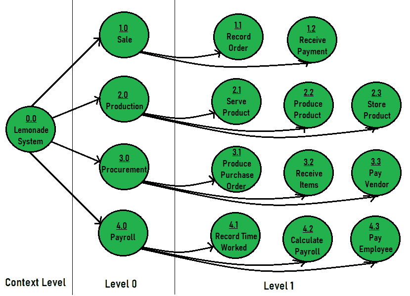

# DFD 和 ERD 的区别

> 原文:[https://www . geesforgeks . org/difference-DFD-and-erd/](https://www.geeksforgeeks.org/difference-between-dfd-and-erd/)

**1。[数据流程图(DFD)](https://www.geeksforgeeks.org/levels-in-data-flow-diagrams-dfd/) :**
数据意味着信息，流程意味着移动，图意味着一幅画来代表某样东西。因此，DFD 只是数据或信息流的图形表示。它是数据系统的框架或模式。它包括数据输入、数据输出、存储数据。DFD 描述了把数据作为输入，存储数据，把数据作为输出的过程。DGD 描述了完成这个过程的数据路径。

DFD 主要有两种类型:物理数据流图和逻辑数据流图。

**DFD 示例–**柠檬水摊

**2。[实体关系图(ERD)](https://www.geeksforgeeks.org/introduction-of-er-model/) :**
ERD 也被称为实体关系模型。ERD 最初是由陈品山提出的。实体是指用于存储信息并可区分的任何对象，关系是指连接，而图/模型是指用于表示某种事物的图片。因此，ERD 只是用来表示或显示存储在数据库中的实体或数据对象之间的关系的图表或模型。E-R 模型的主要组成部分是实体、属性和关系。这是一种非常简单的表示数据库设计的方式。

**ERD 示例–**学校信息管理

**DFD 和 ERD 的区别:**

| 没有。 | DFD | 诱发反应测定器 |
| 1. | 它代表数据流图。 | 它代表实体关系图或模型。 |
| 2. | 主要目标是表示它们之间的流程和数据流。 | 主要目标是表示数据对象或实体以及它们之间的关系。 |
| 3. | 它解释了数据输入、数据输出和存储数据的流程和过程。 | 它解释并表示存储在数据库中的实体之间的关系。 |
| 4. | DFD 使用的符号有:矩形(代表数据实体)、圆形(代表过程)、箭头(代表数据流)、椭圆形或平行线(代表数据存储)。 | ERD 使用的符号有:矩形(代表实体)、菱形框(代表关系)、线条和标准符号(代表基数)。 |
| 5. | DFD 遵循的规则是，至少应该有一个数据流进入和离开流程或存储。 | ERD 遵循的规则是，所有实体都必须代表相似事物的集合。 |
| 6. | 它对系统中的数据流进行建模。 | 它对像人、物体、地点和事件这样的实体建模，数据存储在系统中。 |

