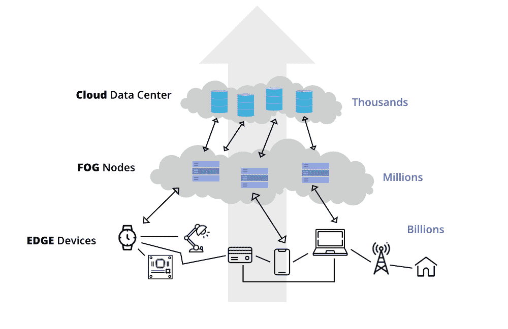

# 边缘计算和雾计算的区别

> 原文:[https://www . geeksforgeeks . org/边缘计算和雾计算的区别/](https://www.geeksforgeeks.org/difference-between-edge-computing-and-fog-computing/)

云计算是指通过互联网按需交付信息技术服务/资源。互联网上的按需计算服务只不过是云计算。通过使用云计算，用户可以随时随地访问服务。

如今，全球每秒钟都会产生大量数据。企业从人们那里收集和处理数据，并获得分析来扩展他们的业务。当许多组织在数据中心的远程服务器上同时访问其数据时，可能会出现数据流量。数据流量会导致数据访问延迟、带宽降低等。但是[云计算](https://www.geeksforgeeks.org/cloud-computing/)技术本身不足以有效存储和处理海量数据并快速响应。

*例如，*在特斯拉自动驾驶汽车中，传感器不断监测汽车周围的某些区域。如果它发现路上有障碍物或行人，那么汽车必须停下来或四处移动，不要撞到。当障碍物在路上时，通过传感器发送的数据必须快速处理，并帮助汽车在碰撞前检测到。稍微延迟发现可能是一个主要问题。为了克服这些挑战，引入了[边缘计算](https://www.geeksforgeeks.org/edge-computing/)和[雾计算](https://www.geeksforgeeks.org/fog-computing/)。

边缘和雾计算

### **边缘计算**

计算发生在设备网络的边缘，称为边缘计算。这意味着计算机与设备的网络相连，设备处理数据并将数据实时发送到云。那台计算机被称为“[边缘计算机](https://www.geeksforgeeks.org/what-is-edge-computing-and-its-importance-in-the-future/)或“边缘节点”。

有了这项技术，数据被处理并立即传输到设备。然而，边缘节点传输设备捕获或生成的所有数据，而不管数据的重要性如何。

这里***雾计算*****被引入，成为一个理想的解决方案。**

### ****雾计算****

**雾计算是云计算的延伸。它是在边缘和云之间的一层。当边缘计算机向云中发送大量数据时，雾节点接收数据并分析什么是重要的。然后雾节点将重要数据转移到云上进行存储，并删除不重要的数据或保留在自己身上进行进一步分析。通过这种方式，雾计算节省了云中的大量空间，并快速传输重要数据。**

### **边缘计算和雾计算的区别**

<figure class="table">

| 

**序列号**

 | 

**边缘计算**

 | 

**雾计算**

 |
| --- | --- | --- |
| 01. | 比雾计算扩展性差。 | 与边缘计算相比，具有高度可扩展性。 |
| 02. | 存在数十亿个节点。 | 存在数百万个节点。 |
| 03. | 节点安装在远离云的地方。 | 该计算中的节点安装在更靠近云的位置(存储数据的远程数据库)。 |
| 04. | 边缘计算是雾计算的一个分支。 | 雾计算是云计算的一个分支。 |
| 05. | 带宽要求非常低。因为数据来自边缘节点本身。 | 带宽要求很高。源自边缘节点的数据被传输到云中。 |
| 06. | 运营成本较高。 | 运营成本相对较低。 |
| 07. | 高度隐私。对数据的攻击非常少。 | 数据攻击的概率更高。 |
| 08. | 边缘设备包括物联网设备或客户端网络。 | 雾是一层延伸的云。 |
| 09. | 节点功耗低。 | 节点的功耗从从设备收集的大量数据中过滤重要信息，并将其保存在过滤器中。 |
| 10. | 边缘计算通过处理从设备同时接收的数据，帮助设备获得更快的结果。 | 雾计算有助于从从设备收集的大量数据中过滤重要信息，并通过发送过滤后的数据将其保存在云中。 |

</figure>