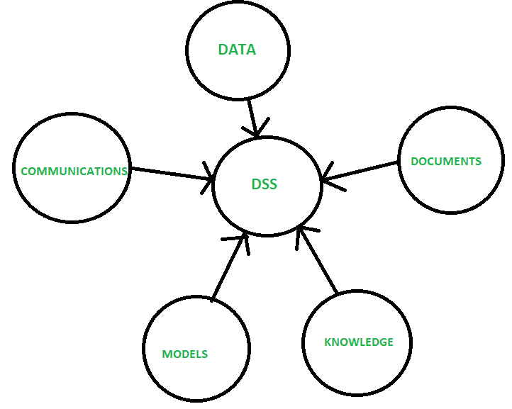
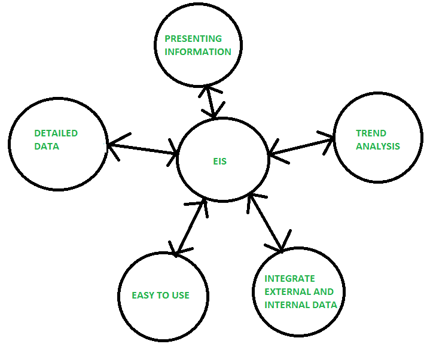

# EIS 和 DSS 的区别

> 原文:[https://www . geesforgeks . org/EIS 和 dss 之间的区别/](https://www.geeksforgeeks.org/difference-between-eis-and-dss/)

**1。[决策支持系统(DSS)](https://practice.geeksforgeeks.org/problems/what-is-dss) :**
这是一个基于计算机的系统，帮助决策过程。它是一个交互式、灵活和适应性强的计算机系统。它是专门为支持非结构化管理问题的解决而开发的，以改进决策制定。

决策支持系统是支持业务和组织决策活动的一类特定的计算机化信息系统。

**优势:**

*   它节省时间。
*   提高效率。
*   降低成本。
*   它提高了个人效率。
*   它增加了决策者的满意度。

**缺点:**

*   信息霸主。
*   地位降低。
*   过度强调决策。

**2。高管信息系统(EIS) :**
EIS 被定义为帮助高层管理人员做出政策决策的系统。该系统使用高级数据、分析模型和用户友好的软件进行决策。这是一个结构化的自动跟踪系统，可持续运行以保持一切得到管理。它提供异常和状态报告功能。

**优势:**

*   易于使用。
*   分析趋势的能力。
*   时间管理。
*   效率。
*   增强业务问题的解决。

**缺点:**

*   功能有限。
*   难以保持最新数据。
*   系统可能运行缓慢。
*   不太可靠。

**决策支持系统和环境影响报告书的区别:**

| 决策支持系统(Decision Support Systems) | 电化学阻抗谱（Electrochemical Impedance Spectroscopy 的缩写） |
| --- | --- |
| 专业人士使用。 | 它被管理人员使用。 |
| 它是日常操作所必需的。 | 战略计划和程序需要它。 |
| 它处理半结构化和非结构化数据。 | 它只处理非结构化数据。 |
| 它只包含内部信息。 | 它由内部和外部信息组成。 |
| 它允许做出非常规的决定。 | 它允许做出满足组织战略目标的决策。 |
| 它用于大型机、微系统和分布式系统。 | 它用于分布式系统。 |

