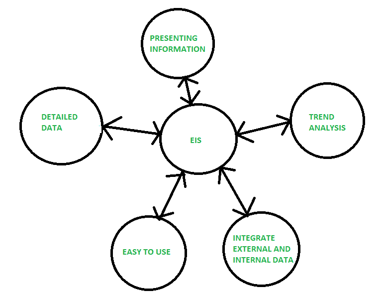
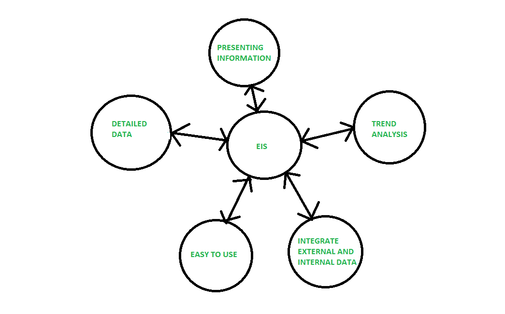
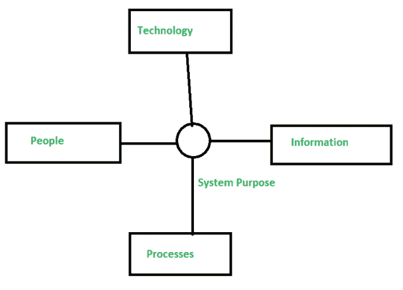

# EIS 与传统信息系统的区别

> 原文:[https://www . geesforgeks . org/EIS 与传统信息系统的区别/](https://www.geeksforgeeks.org/difference-between-eis-and-traditional-information-system/)

**1。高管信息系统(EIS) :**
EIS 被定义为帮助高层管理人员做出政策决策的系统。该系统使用高级数据、分析模型和用户友好的软件进行决策。这是一个结构化的自动跟踪系统，可持续运行以保持一切得到管理。它提供异常和状态报告功能。

**优势:**

*   易于使用。
*   分析趋势的能力
*   时间管理
*   效率
*   增强业务问题的解决

**缺点:**

*   功能有限。
*   难以保持最新数据。
*   系统可能运行缓慢。
*   不太可靠。

**2。传统信息系统:**
传统信息系统是围绕不同的功能构建的，不同的部门之间不会相互交流，因此无法自动交换信息。经理们可能很难收集他们处理业务所需的数据。

**优势:**

*   每个阶段结束时的正式审查允许最大限度的管理控制。
*   这种方法创建了大量的系统文档。
*   正式文档确保系统需求可以追溯到规定的业务需求。
*   它生产许多中间产品，可以审查这些产品是否满足用户需求，是否达到标准。

**缺点:**

*   用户得到一个满足开发者理解的需求的系统。所以，这可能不是用户真正需要的。
*   文档是昂贵的。
*   耗时
*   用户不能轻易地评审中间产品并根据他们的需要进行评估。

**EIS 与传统信息系统的区别:**

| 电化学阻抗谱（Electrochemical Impedance Spectroscopy 的缩写） | 传统信息系统 |
| --- | --- |
| 它由最高管理层处理。 | 由下级员工处理。 |
| 信息由在线工具和分析提供。 | 信息由离线状态报告提供。 |
| 信息来源多是外部的，少是内部的。 | 信息来源是内部的。 |
| 可以连续查看详细信息。 | 没有在连续级别查看详细信息的工具。 |
| 信息以文字和图形的形式出现。 | 信息以表格的形式出现。 |
| 它是用户友好的。 | 它是计算机操作员生成的。 |

