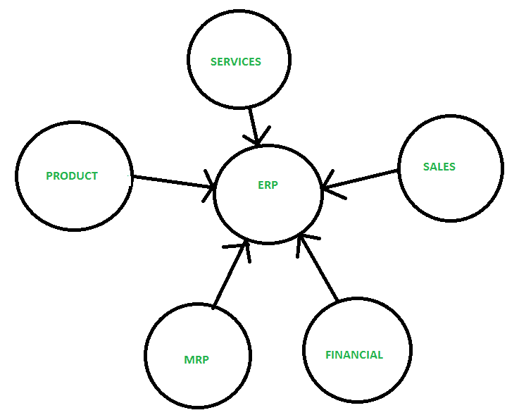
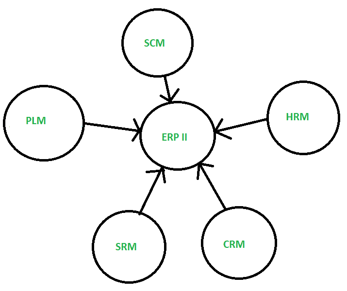

# ERP 与 ERP II 的区别

> 原文:[https://www . geesforgeks . org/ERP-和-erp-ii 的区别/](https://www.geeksforgeeks.org/difference-between-erp-and-erp-ii/)

**1。[企业资源计划(ERP)](https://practice.geeksforgeeks.org/problems/what-is-enterprise-resource-planning-erp-and-what-kind-of-a-database-is-used-in-an-erp-application) :**
企业资源计划是国内和全球运营的基础系统，支持其日常运营中的大部分或全部功能领域。是商业软件中比较常见的类别之一，尤其是对于大型企业。

它是一种业务策略和一组特定于行业领域的应用程序，通过启用和优化企业和企业间的协作运营和财务流程，构建客户和股东社区价值网络系统。企业资源规划的核心是通过数据管理集中信息和工作流程的有效方式。因为 ERP 将您所有的工作流数据保存在一个地方。

ERP II 是现在用来形容 ERP 的名字。基本上是 ERP 的继承者。它是企业内部和外部的一种业务战略和一套协作的运营和财务流程。

这些新的业务模式反映了对内部集成的业务关注的增加。它的领域遍及所有部门和细分市场。此处的数据是内部和外部发布和订阅的。它包括部门模块、客户关系管理、供应链管理和其他利益相关者模块。它强调无形资产。

**ERP 与 ERP 二的区别:**

| 企业资源计划（Enterprise Resource Planning） | ERP II(企业资源规划系统) |
| --- | --- |
| 是 90 年代发展起来的。 | 它是在 2000 年代发展起来的。 |
| 企业资源规划关注的是优化企业内部优化。 | 这些系统通过与贸易伙伴的合作来优化供应链。 |
| 专注于制造和分销。 | 专注于所有行业和业务领域。 |
| 它的过程是内在的、隐藏的。 | 它的过程是外部连接的。 |
| 数据是内部生成和使用的。 | 数据在内部和外部发布和订阅。 |
| 它是网络感知的、封闭的和整体的。 | 它是基于网络的、开放的和组件化的。 |

